# Aims

Here I will show the basic usage of SiMBA on a simulated dataset.  I will first go through the data briefly, and then demonstrate fitting the model to this data.


# Libraries


```r
library(tidyverse)
library(rstan)
library(cmdstanr)
library(brms)
library(skimr)
library(ggbeeswarm)
library(job)
library(broom)
library(broom.mixed)
library(lme4)
library(lmerTest)

theme_set(theme_light())
set.seed(555)
```


# Exploring the data

## Loading

I saved the simulated sample data in the RawData folder.


```r
simdat <- readRDS("../RawData/simdata.rds")

head(simdat)
```

<div data-pagedtable="false">
  <script data-pagedtable-source type="application/json">
{"columns":[{"label":["n"],"name":[1],"type":["dbl"],"align":["right"]},{"label":["Regions"],"name":[2],"type":["chr"],"align":["left"]},{"label":["Difference"],"name":[3],"type":["dbl"],"align":["right"]},{"label":["sigma"],"name":[4],"type":["chr"],"align":["left"]},{"label":["Region"],"name":[5],"type":["chr"],"align":["left"]},{"label":["logK1_true"],"name":[6],"type":["dbl"],"align":["right"]},{"label":["logBPnd_true"],"name":[7],"type":["dbl"],"align":["right"]},{"label":["logVnd_true"],"name":[8],"type":["dbl"],"align":["right"]},{"label":["logk4_true"],"name":[9],"type":["dbl"],"align":["right"]},{"label":["logvB_true"],"name":[10],"type":["dbl"],"align":["right"]},{"label":["sigma_true"],"name":[11],"type":["dbl"],"align":["right"]},{"label":["inpshift_mod"],"name":[12],"type":["dbl"],"align":["right"]},{"label":["A"],"name":[13],"type":["dbl"],"align":["right"]},{"label":["B"],"name":[14],"type":["dbl"],"align":["right"]},{"label":["C"],"name":[15],"type":["dbl"],"align":["right"]},{"label":["alpha"],"name":[16],"type":["dbl"],"align":["right"]},{"label":["beta"],"name":[17],"type":["dbl"],"align":["right"]},{"label":["gamma"],"name":[18],"type":["dbl"],"align":["right"]},{"label":["peaktime"],"name":[19],"type":["dbl"],"align":["right"]},{"label":["peakval"],"name":[20],"type":["dbl"],"align":["right"]},{"label":["t0"],"name":[21],"type":["dbl"],"align":["right"]},{"label":["slope"],"name":[22],"type":["dbl"],"align":["right"]},{"label":["t_tac"],"name":[23],"type":["dbl"],"align":["right"]},{"label":["durations"],"name":[24],"type":["dbl"],"align":["right"]},{"label":["meanblood"],"name":[25],"type":["dbl"],"align":["right"]},{"label":["sigwig"],"name":[26],"type":["dbl"],"align":["right"]},{"label":["TAC"],"name":[27],"type":["dbl"],"align":["right"]},{"label":["sigma_w_true"],"name":[28],"type":["dbl"],"align":["right"]},{"label":["TAC_true"],"name":[29],"type":["dbl"],"align":["right"]},{"label":["WAYID"],"name":[30],"type":["int"],"align":["right"]},{"label":["Group"],"name":[31],"type":["chr"],"align":["left"]}],"data":[{"1":"10","2":"all","3":"0.182","4":"10%","5":"dor","6":"-2.14728","7":"2.040876","8":"-0.8231854","9":"-3.666544","10":"-3.518643","11":"-3.391607","12":"0.01115423","13":"181.6999","14":"1.348521","15":"0.037839","16":"4.902644","17":"0.3670342","18":"0.02419838","19":"1.177854","20":"3.608804","21":"0.324694","22":"4.229925","23":"0.16667","24":"0.33333","25":"0.0000000","26":"0.7977002","27":"-0.02622032","28":"-2.593907","29":"0.00000000","30":"1","31":"Control"},{"1":"10","2":"all","3":"0.182","4":"10%","5":"dor","6":"-2.14728","7":"2.040876","8":"-0.8231854","9":"-3.666544","10":"-3.518643","11":"-3.391607","12":"0.01115423","13":"181.6999","14":"1.348521","15":"0.037839","16":"4.902644","17":"0.3670342","18":"0.02419838","19":"1.177854","20":"3.608804","21":"0.324694","22":"4.229925","23":"0.50000","24":"0.33333","25":"0.6310248","26":"0.7540168","27":"0.02850400","28":"-2.637590","29":"0.02595788","30":"1","31":"Control"},{"1":"10","2":"all","3":"0.182","4":"10%","5":"dor","6":"-2.14728","7":"2.040876","8":"-0.8231854","9":"-3.666544","10":"-3.518643","11":"-3.391607","12":"0.01115423","13":"181.6999","14":"1.348521","15":"0.037839","16":"4.902644","17":"0.3670342","18":"0.02419838","19":"1.177854","20":"3.608804","21":"0.324694","22":"4.229925","23":"0.83333","24":"0.33333","25":"2.6889425","26":"0.7103335","27":"0.14091504","28":"-2.681273","29":"0.13907418","30":"1","31":"Control"},{"1":"10","2":"all","3":"0.182","4":"10%","5":"dor","6":"-2.14728","7":"2.040876","8":"-0.8231854","9":"-3.666544","10":"-3.518643","11":"-3.391607","12":"0.01115423","13":"181.6999","14":"1.348521","15":"0.037839","16":"4.902644","17":"0.3670342","18":"0.02419838","19":"1.177854","20":"3.608804","21":"0.324694","22":"4.229925","23":"1.50000","24":"1.00000","25":"2.0213709","26":"0.6234815","27":"0.41909213","28":"-2.768125","29":"0.29228269","30":"1","31":"Control"},{"1":"10","2":"all","3":"0.182","4":"10%","5":"dor","6":"-2.14728","7":"2.040876","8":"-0.8231854","9":"-3.666544","10":"-3.518643","11":"-3.391607","12":"0.01115423","13":"181.6999","14":"1.348521","15":"0.037839","16":"4.902644","17":"0.3670342","18":"0.02419838","19":"1.177854","20":"3.608804","21":"0.324694","22":"4.229925","23":"2.50000","24":"1.00000","25":"0.9368015","26":"0.4954552","27":"0.30573178","28":"-2.896152","29":"0.30243776","30":"1","31":"Control"},{"1":"10","2":"all","3":"0.182","4":"10%","5":"dor","6":"-2.14728","7":"2.040876","8":"-0.8231854","9":"-3.666544","10":"-3.518643","11":"-3.391607","12":"0.01115423","13":"181.6999","14":"1.348521","15":"0.037839","16":"4.902644","17":"0.3670342","18":"0.02419838","19":"1.177854","20":"3.608804","21":"0.324694","22":"4.229925","23":"3.50000","24":"1.00000","25":"0.9125220","26":"0.3728948","27":"0.31820929","28":"-3.018712","29":"0.31057001","30":"1","31":"Control"}],"options":{"columns":{"min":{},"max":[10]},"rows":{"min":[10],"max":[10]},"pages":{}}}
  </script>
</div>

```r
skim(simdat)
```


<table style='width: auto;'
        class='table table-condensed'>
<caption>Data summary</caption>
 <thead>
  <tr>
   <th style="text-align:left;">   </th>
   <th style="text-align:left;">   </th>
  </tr>
 </thead>
<tbody>
  <tr>
   <td style="text-align:left;"> Name </td>
   <td style="text-align:left;"> simdat </td>
  </tr>
  <tr>
   <td style="text-align:left;"> Number of rows </td>
   <td style="text-align:left;"> 3600 </td>
  </tr>
  <tr>
   <td style="text-align:left;"> Number of columns </td>
   <td style="text-align:left;"> 31 </td>
  </tr>
  <tr>
   <td style="text-align:left;"> _______________________ </td>
   <td style="text-align:left;">  </td>
  </tr>
  <tr>
   <td style="text-align:left;"> Column type frequency: </td>
   <td style="text-align:left;">  </td>
  </tr>
  <tr>
   <td style="text-align:left;"> character </td>
   <td style="text-align:left;"> 4 </td>
  </tr>
  <tr>
   <td style="text-align:left;"> numeric </td>
   <td style="text-align:left;"> 27 </td>
  </tr>
  <tr>
   <td style="text-align:left;"> ________________________ </td>
   <td style="text-align:left;">  </td>
  </tr>
  <tr>
   <td style="text-align:left;"> Group variables </td>
   <td style="text-align:left;"> None </td>
  </tr>
</tbody>
</table>


**Variable type: character**

<table>
 <thead>
  <tr>
   <th style="text-align:left;"> skim_variable </th>
   <th style="text-align:right;"> n_missing </th>
   <th style="text-align:right;"> complete_rate </th>
   <th style="text-align:right;"> min </th>
   <th style="text-align:right;"> max </th>
   <th style="text-align:right;"> empty </th>
   <th style="text-align:right;"> n_unique </th>
   <th style="text-align:right;"> whitespace </th>
  </tr>
 </thead>
<tbody>
  <tr>
   <td style="text-align:left;"> Regions </td>
   <td style="text-align:right;"> 0 </td>
   <td style="text-align:right;"> 1 </td>
   <td style="text-align:right;"> 3 </td>
   <td style="text-align:right;"> 3 </td>
   <td style="text-align:right;"> 0 </td>
   <td style="text-align:right;"> 1 </td>
   <td style="text-align:right;"> 0 </td>
  </tr>
  <tr>
   <td style="text-align:left;"> sigma </td>
   <td style="text-align:right;"> 0 </td>
   <td style="text-align:right;"> 1 </td>
   <td style="text-align:right;"> 3 </td>
   <td style="text-align:right;"> 3 </td>
   <td style="text-align:right;"> 0 </td>
   <td style="text-align:right;"> 1 </td>
   <td style="text-align:right;"> 0 </td>
  </tr>
  <tr>
   <td style="text-align:left;"> Region </td>
   <td style="text-align:right;"> 0 </td>
   <td style="text-align:right;"> 1 </td>
   <td style="text-align:right;"> 3 </td>
   <td style="text-align:right;"> 15 </td>
   <td style="text-align:right;"> 0 </td>
   <td style="text-align:right;"> 9 </td>
   <td style="text-align:right;"> 0 </td>
  </tr>
  <tr>
   <td style="text-align:left;"> Group </td>
   <td style="text-align:right;"> 0 </td>
   <td style="text-align:right;"> 1 </td>
   <td style="text-align:right;"> 7 </td>
   <td style="text-align:right;"> 7 </td>
   <td style="text-align:right;"> 0 </td>
   <td style="text-align:right;"> 2 </td>
   <td style="text-align:right;"> 0 </td>
  </tr>
</tbody>
</table>


**Variable type: numeric**

<table>
 <thead>
  <tr>
   <th style="text-align:left;"> skim_variable </th>
   <th style="text-align:right;"> n_missing </th>
   <th style="text-align:right;"> complete_rate </th>
   <th style="text-align:right;"> mean </th>
   <th style="text-align:right;"> sd </th>
   <th style="text-align:right;"> p0 </th>
   <th style="text-align:right;"> p25 </th>
   <th style="text-align:right;"> p50 </th>
   <th style="text-align:right;"> p75 </th>
   <th style="text-align:right;"> p100 </th>
   <th style="text-align:left;"> hist </th>
  </tr>
 </thead>
<tbody>
  <tr>
   <td style="text-align:left;"> n </td>
   <td style="text-align:right;"> 0 </td>
   <td style="text-align:right;"> 1 </td>
   <td style="text-align:right;"> 10.00 </td>
   <td style="text-align:right;"> 0.00 </td>
   <td style="text-align:right;"> 10.00 </td>
   <td style="text-align:right;"> 10.00 </td>
   <td style="text-align:right;"> 10.00 </td>
   <td style="text-align:right;"> 10.00 </td>
   <td style="text-align:right;"> 10.00 </td>
   <td style="text-align:left;"> ▁▁▇▁▁ </td>
  </tr>
  <tr>
   <td style="text-align:left;"> Difference </td>
   <td style="text-align:right;"> 0 </td>
   <td style="text-align:right;"> 1 </td>
   <td style="text-align:right;"> 0.18 </td>
   <td style="text-align:right;"> 0.00 </td>
   <td style="text-align:right;"> 0.18 </td>
   <td style="text-align:right;"> 0.18 </td>
   <td style="text-align:right;"> 0.18 </td>
   <td style="text-align:right;"> 0.18 </td>
   <td style="text-align:right;"> 0.18 </td>
   <td style="text-align:left;"> ▁▁▇▁▁ </td>
  </tr>
  <tr>
   <td style="text-align:left;"> logK1_true </td>
   <td style="text-align:right;"> 0 </td>
   <td style="text-align:right;"> 1 </td>
   <td style="text-align:right;"> -2.47 </td>
   <td style="text-align:right;"> 0.30 </td>
   <td style="text-align:right;"> -3.35 </td>
   <td style="text-align:right;"> -2.70 </td>
   <td style="text-align:right;"> -2.45 </td>
   <td style="text-align:right;"> -2.25 </td>
   <td style="text-align:right;"> -1.88 </td>
   <td style="text-align:left;"> ▁▃▆▇▃ </td>
  </tr>
  <tr>
   <td style="text-align:left;"> logBPnd_true </td>
   <td style="text-align:right;"> 0 </td>
   <td style="text-align:right;"> 1 </td>
   <td style="text-align:right;"> 1.99 </td>
   <td style="text-align:right;"> 0.39 </td>
   <td style="text-align:right;"> 1.26 </td>
   <td style="text-align:right;"> 1.64 </td>
   <td style="text-align:right;"> 2.00 </td>
   <td style="text-align:right;"> 2.27 </td>
   <td style="text-align:right;"> 2.97 </td>
   <td style="text-align:left;"> ▆▆▇▅▁ </td>
  </tr>
  <tr>
   <td style="text-align:left;"> logVnd_true </td>
   <td style="text-align:right;"> 0 </td>
   <td style="text-align:right;"> 1 </td>
   <td style="text-align:right;"> -0.59 </td>
   <td style="text-align:right;"> 0.44 </td>
   <td style="text-align:right;"> -1.71 </td>
   <td style="text-align:right;"> -0.80 </td>
   <td style="text-align:right;"> -0.59 </td>
   <td style="text-align:right;"> -0.29 </td>
   <td style="text-align:right;"> 0.40 </td>
   <td style="text-align:left;"> ▂▂▇▆▂ </td>
  </tr>
  <tr>
   <td style="text-align:left;"> logk4_true </td>
   <td style="text-align:right;"> 0 </td>
   <td style="text-align:right;"> 1 </td>
   <td style="text-align:right;"> -3.82 </td>
   <td style="text-align:right;"> 0.20 </td>
   <td style="text-align:right;"> -4.46 </td>
   <td style="text-align:right;"> -3.96 </td>
   <td style="text-align:right;"> -3.77 </td>
   <td style="text-align:right;"> -3.67 </td>
   <td style="text-align:right;"> -3.34 </td>
   <td style="text-align:left;"> ▁▃▅▇▁ </td>
  </tr>
  <tr>
   <td style="text-align:left;"> logvB_true </td>
   <td style="text-align:right;"> 0 </td>
   <td style="text-align:right;"> 1 </td>
   <td style="text-align:right;"> -3.81 </td>
   <td style="text-align:right;"> 0.71 </td>
   <td style="text-align:right;"> -5.56 </td>
   <td style="text-align:right;"> -4.29 </td>
   <td style="text-align:right;"> -3.78 </td>
   <td style="text-align:right;"> -3.46 </td>
   <td style="text-align:right;"> -2.10 </td>
   <td style="text-align:left;"> ▁▅▇▃▂ </td>
  </tr>
  <tr>
   <td style="text-align:left;"> sigma_true </td>
   <td style="text-align:right;"> 0 </td>
   <td style="text-align:right;"> 1 </td>
   <td style="text-align:right;"> -4.23 </td>
   <td style="text-align:right;"> 0.57 </td>
   <td style="text-align:right;"> -5.53 </td>
   <td style="text-align:right;"> -4.62 </td>
   <td style="text-align:right;"> -4.26 </td>
   <td style="text-align:right;"> -3.85 </td>
   <td style="text-align:right;"> -2.40 </td>
   <td style="text-align:left;"> ▂▇▇▂▁ </td>
  </tr>
  <tr>
   <td style="text-align:left;"> inpshift_mod </td>
   <td style="text-align:right;"> 0 </td>
   <td style="text-align:right;"> 1 </td>
   <td style="text-align:right;"> -0.09 </td>
   <td style="text-align:right;"> 0.13 </td>
   <td style="text-align:right;"> -0.24 </td>
   <td style="text-align:right;"> -0.18 </td>
   <td style="text-align:right;"> -0.10 </td>
   <td style="text-align:right;"> -0.07 </td>
   <td style="text-align:right;"> 0.35 </td>
   <td style="text-align:left;"> ▇▇▂▁▁ </td>
  </tr>
  <tr>
   <td style="text-align:left;"> A </td>
   <td style="text-align:right;"> 0 </td>
   <td style="text-align:right;"> 1 </td>
   <td style="text-align:right;"> 27.66 </td>
   <td style="text-align:right;"> 40.29 </td>
   <td style="text-align:right;"> 0.19 </td>
   <td style="text-align:right;"> 4.23 </td>
   <td style="text-align:right;"> 13.44 </td>
   <td style="text-align:right;"> 29.03 </td>
   <td style="text-align:right;"> 181.70 </td>
   <td style="text-align:left;"> ▇▂▁▁▁ </td>
  </tr>
  <tr>
   <td style="text-align:left;"> B </td>
   <td style="text-align:right;"> 0 </td>
   <td style="text-align:right;"> 1 </td>
   <td style="text-align:right;"> 1.08 </td>
   <td style="text-align:right;"> 0.44 </td>
   <td style="text-align:right;"> 0.30 </td>
   <td style="text-align:right;"> 0.73 </td>
   <td style="text-align:right;"> 1.14 </td>
   <td style="text-align:right;"> 1.32 </td>
   <td style="text-align:right;"> 1.92 </td>
   <td style="text-align:left;"> ▆▆▇▆▅ </td>
  </tr>
  <tr>
   <td style="text-align:left;"> C </td>
   <td style="text-align:right;"> 0 </td>
   <td style="text-align:right;"> 1 </td>
   <td style="text-align:right;"> 0.04 </td>
   <td style="text-align:right;"> 0.02 </td>
   <td style="text-align:right;"> 0.01 </td>
   <td style="text-align:right;"> 0.02 </td>
   <td style="text-align:right;"> 0.03 </td>
   <td style="text-align:right;"> 0.05 </td>
   <td style="text-align:right;"> 0.07 </td>
   <td style="text-align:left;"> ▇▅▁▃▆ </td>
  </tr>
  <tr>
   <td style="text-align:left;"> alpha </td>
   <td style="text-align:right;"> 0 </td>
   <td style="text-align:right;"> 1 </td>
   <td style="text-align:right;"> 2.80 </td>
   <td style="text-align:right;"> 1.19 </td>
   <td style="text-align:right;"> 0.49 </td>
   <td style="text-align:right;"> 2.10 </td>
   <td style="text-align:right;"> 3.06 </td>
   <td style="text-align:right;"> 3.42 </td>
   <td style="text-align:right;"> 4.90 </td>
   <td style="text-align:left;"> ▆▃▇▇▆ </td>
  </tr>
  <tr>
   <td style="text-align:left;"> beta </td>
   <td style="text-align:right;"> 0 </td>
   <td style="text-align:right;"> 1 </td>
   <td style="text-align:right;"> 0.48 </td>
   <td style="text-align:right;"> 0.14 </td>
   <td style="text-align:right;"> 0.17 </td>
   <td style="text-align:right;"> 0.39 </td>
   <td style="text-align:right;"> 0.50 </td>
   <td style="text-align:right;"> 0.58 </td>
   <td style="text-align:right;"> 0.72 </td>
   <td style="text-align:left;"> ▂▃▇▇▅ </td>
  </tr>
  <tr>
   <td style="text-align:left;"> gamma </td>
   <td style="text-align:right;"> 0 </td>
   <td style="text-align:right;"> 1 </td>
   <td style="text-align:right;"> 0.03 </td>
   <td style="text-align:right;"> 0.01 </td>
   <td style="text-align:right;"> 0.02 </td>
   <td style="text-align:right;"> 0.02 </td>
   <td style="text-align:right;"> 0.04 </td>
   <td style="text-align:right;"> 0.04 </td>
   <td style="text-align:right;"> 0.04 </td>
   <td style="text-align:left;"> ▆▁▂▆▇ </td>
  </tr>
  <tr>
   <td style="text-align:left;"> peaktime </td>
   <td style="text-align:right;"> 0 </td>
   <td style="text-align:right;"> 1 </td>
   <td style="text-align:right;"> 1.06 </td>
   <td style="text-align:right;"> 0.18 </td>
   <td style="text-align:right;"> 0.82 </td>
   <td style="text-align:right;"> 0.94 </td>
   <td style="text-align:right;"> 1.06 </td>
   <td style="text-align:right;"> 1.13 </td>
   <td style="text-align:right;"> 1.57 </td>
   <td style="text-align:left;"> ▆▇▃▁▁ </td>
  </tr>
  <tr>
   <td style="text-align:left;"> peakval </td>
   <td style="text-align:right;"> 0 </td>
   <td style="text-align:right;"> 1 </td>
   <td style="text-align:right;"> 2.53 </td>
   <td style="text-align:right;"> 0.95 </td>
   <td style="text-align:right;"> 0.80 </td>
   <td style="text-align:right;"> 1.92 </td>
   <td style="text-align:right;"> 2.27 </td>
   <td style="text-align:right;"> 3.26 </td>
   <td style="text-align:right;"> 4.58 </td>
   <td style="text-align:left;"> ▃▇▅▆▁ </td>
  </tr>
  <tr>
   <td style="text-align:left;"> t0 </td>
   <td style="text-align:right;"> 0 </td>
   <td style="text-align:right;"> 1 </td>
   <td style="text-align:right;"> 0.34 </td>
   <td style="text-align:right;"> 0.15 </td>
   <td style="text-align:right;"> 0.05 </td>
   <td style="text-align:right;"> 0.27 </td>
   <td style="text-align:right;"> 0.33 </td>
   <td style="text-align:right;"> 0.44 </td>
   <td style="text-align:right;"> 0.76 </td>
   <td style="text-align:left;"> ▅▅▇▁▁ </td>
  </tr>
  <tr>
   <td style="text-align:left;"> slope </td>
   <td style="text-align:right;"> 0 </td>
   <td style="text-align:right;"> 1 </td>
   <td style="text-align:right;"> 3.89 </td>
   <td style="text-align:right;"> 1.78 </td>
   <td style="text-align:right;"> 0.85 </td>
   <td style="text-align:right;"> 2.74 </td>
   <td style="text-align:right;"> 3.69 </td>
   <td style="text-align:right;"> 5.22 </td>
   <td style="text-align:right;"> 7.93 </td>
   <td style="text-align:left;"> ▅▇▅▇▁ </td>
  </tr>
  <tr>
   <td style="text-align:left;"> t_tac </td>
   <td style="text-align:right;"> 0 </td>
   <td style="text-align:right;"> 1 </td>
   <td style="text-align:right;"> 32.36 </td>
   <td style="text-align:right;"> 34.55 </td>
   <td style="text-align:right;"> 0.17 </td>
   <td style="text-align:right;"> 3.31 </td>
   <td style="text-align:right;"> 15.12 </td>
   <td style="text-align:right;"> 57.68 </td>
   <td style="text-align:right;"> 105.24 </td>
   <td style="text-align:left;"> ▇▂▂▂▂ </td>
  </tr>
  <tr>
   <td style="text-align:left;"> durations </td>
   <td style="text-align:right;"> 0 </td>
   <td style="text-align:right;"> 1 </td>
   <td style="text-align:right;"> 5.50 </td>
   <td style="text-align:right;"> 4.25 </td>
   <td style="text-align:right;"> 0.33 </td>
   <td style="text-align:right;"> 1.00 </td>
   <td style="text-align:right;"> 5.00 </td>
   <td style="text-align:right;"> 10.00 </td>
   <td style="text-align:right;"> 10.00 </td>
   <td style="text-align:left;"> ▇▁▂▁▇ </td>
  </tr>
  <tr>
   <td style="text-align:left;"> meanblood </td>
   <td style="text-align:right;"> 0 </td>
   <td style="text-align:right;"> 1 </td>
   <td style="text-align:right;"> 0.41 </td>
   <td style="text-align:right;"> 0.58 </td>
   <td style="text-align:right;"> 0.00 </td>
   <td style="text-align:right;"> 0.05 </td>
   <td style="text-align:right;"> 0.18 </td>
   <td style="text-align:right;"> 0.55 </td>
   <td style="text-align:right;"> 4.32 </td>
   <td style="text-align:left;"> ▇▁▁▁▁ </td>
  </tr>
  <tr>
   <td style="text-align:left;"> sigwig </td>
   <td style="text-align:right;"> 0 </td>
   <td style="text-align:right;"> 1 </td>
   <td style="text-align:right;"> 0.00 </td>
   <td style="text-align:right;"> 0.47 </td>
   <td style="text-align:right;"> -0.62 </td>
   <td style="text-align:right;"> -0.42 </td>
   <td style="text-align:right;"> -0.06 </td>
   <td style="text-align:right;"> 0.40 </td>
   <td style="text-align:right;"> 0.80 </td>
   <td style="text-align:left;"> ▇▅▃▃▅ </td>
  </tr>
  <tr>
   <td style="text-align:left;"> TAC </td>
   <td style="text-align:right;"> 0 </td>
   <td style="text-align:right;"> 1 </td>
   <td style="text-align:right;"> 0.13 </td>
   <td style="text-align:right;"> 0.09 </td>
   <td style="text-align:right;"> -0.29 </td>
   <td style="text-align:right;"> 0.07 </td>
   <td style="text-align:right;"> 0.12 </td>
   <td style="text-align:right;"> 0.19 </td>
   <td style="text-align:right;"> 0.58 </td>
   <td style="text-align:left;"> ▁▂▇▂▁ </td>
  </tr>
  <tr>
   <td style="text-align:left;"> sigma_w_true </td>
   <td style="text-align:right;"> 0 </td>
   <td style="text-align:right;"> 1 </td>
   <td style="text-align:right;"> -4.23 </td>
   <td style="text-align:right;"> 0.74 </td>
   <td style="text-align:right;"> -6.15 </td>
   <td style="text-align:right;"> -4.76 </td>
   <td style="text-align:right;"> -4.26 </td>
   <td style="text-align:right;"> -3.72 </td>
   <td style="text-align:right;"> -1.61 </td>
   <td style="text-align:left;"> ▂▇▇▃▁ </td>
  </tr>
  <tr>
   <td style="text-align:left;"> TAC_true </td>
   <td style="text-align:right;"> 0 </td>
   <td style="text-align:right;"> 1 </td>
   <td style="text-align:right;"> 0.13 </td>
   <td style="text-align:right;"> 0.09 </td>
   <td style="text-align:right;"> 0.00 </td>
   <td style="text-align:right;"> 0.07 </td>
   <td style="text-align:right;"> 0.12 </td>
   <td style="text-align:right;"> 0.18 </td>
   <td style="text-align:right;"> 0.59 </td>
   <td style="text-align:left;"> ▇▆▂▁▁ </td>
  </tr>
  <tr>
   <td style="text-align:left;"> WAYID </td>
   <td style="text-align:right;"> 0 </td>
   <td style="text-align:right;"> 1 </td>
   <td style="text-align:right;"> 10.50 </td>
   <td style="text-align:right;"> 5.77 </td>
   <td style="text-align:right;"> 1.00 </td>
   <td style="text-align:right;"> 5.75 </td>
   <td style="text-align:right;"> 10.50 </td>
   <td style="text-align:right;"> 15.25 </td>
   <td style="text-align:right;"> 20.00 </td>
   <td style="text-align:left;"> ▇▇▇▇▇ </td>
  </tr>
</tbody>
</table>


## Measured Data

This dataset consists of 10 controls and 10 patients.  The sigma value is set to about 10% of the mean TAC value. There is a group difference of 20% (Cohen's d = 0.55) in all regions.  The unique identifier for each individual is called `WAYID`.


### TAC

For now, I'll just work with the first subject and one region.


```r
subjdat <- simdat %>% 
  filter(WAYID==WAYID[sample(1:nrow(simdat), 1)] & Region=="dor")
```

Let's have a look


```r
subjdat %>% 
  select(t_tac, Measured = TAC, True = TAC_true) %>% 
  ggplot(aes(x=t_tac, y=Measured)) +
  geom_point() + 
  geom_line(aes(y=True), linetype="dashed") +
  labs(title="Simulated TAC from the DLPFC",
       subtitle="Points represent the measured TAC, and the dashed line represents the true TAC without error",
       x = "Time (min)",
       y = "Radioactivity")
```

<!-- -->


### Arterial Input function

The AIF is modelled with a tri-exponential function.


```r
predict_aif <- function(time, t0, slope, peaktime, A, B, C, alpha, beta, gamma) {
  
  t_corr <- time - t0
  t_after_peak <- time - peaktime
  
  if(t_corr <= 0) {
    pred <- 0
    return(pred)
  }
  
  if(t_corr <= peaktime) {
    pred <- t_corr * slope
    return(pred)
  }
  
  if(t_corr > peaktime) {
    pred <- A*exp(-alpha*t_after_peak) + 
      B*exp(-beta*t_after_peak) + 
      C*exp(-gamma*t_after_peak)
    return(pred)
  }
}

time <- seq(0, 105, by=0.01)
aif <- map_dbl(time, ~with(subjdat[1,], 
            predict_aif(.x, t0, slope, peaktime, A, B, C, alpha, beta, gamma)))

AIFdat <- tibble(
  time = time, 
  AIF = aif
)

ggplot(AIFdat, aes(x=time, y=AIF)) + 
  geom_line(colour="red")
```

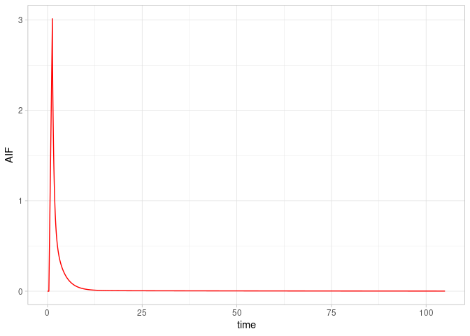<!-- -->


So now, we can show the AIF and the TAC together.


```r
subjdat %>% 
  select(t_tac, Measured = TAC, True = TAC_true) %>% 
  ggplot(aes(x=t_tac, y=Measured)) +
  geom_point() + 
  geom_line(aes(y=True), linetype="dashed") +
  labs(title="Simulated TAC and AIF",
       subtitle="Black represents the TAC and true TAC, while red represents the AIF",
       x = "Time (min)",
       y = "Radioactivity") +
  geom_line(data = AIFdat, aes(x=time, y=AIF), colour="red") +
  coord_cartesian(ylim = c(-0.02, 0.3))
```

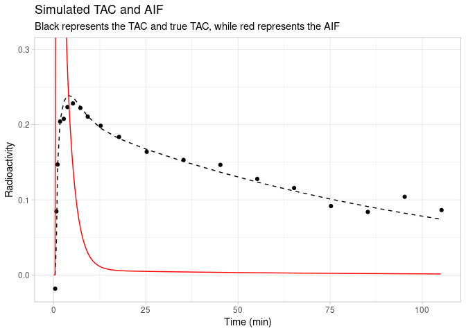<!-- -->

### Whole Blood

We did not have access to whole blood data, as this was not measured. However, we did measure whole plasma data, which we substitute for whole blood data. In preprocessing, I fit a spline to this data, and calculated the mean blood concentration during each frame. This allows us to input blood concentration as a vector like the TAC.


```r
ggplot(subjdat, aes(x=t_tac, y=TAC)) +
  geom_point() + 
  geom_line(aes(x=t_tac, y=meanblood), colour="blue") +
  geom_point(aes(x=t_tac, y=meanblood), colour="blue") +
  geom_line(data = AIFdat, aes(x=time, y=AIF), colour="red") +
  labs(title="Blood, AIF and TAC",
       subtitle="The whole blood is represented in blue, the AIF in red, and the TAC in black",
       x = "Time (min)",
       y = "Radioactivity")
```

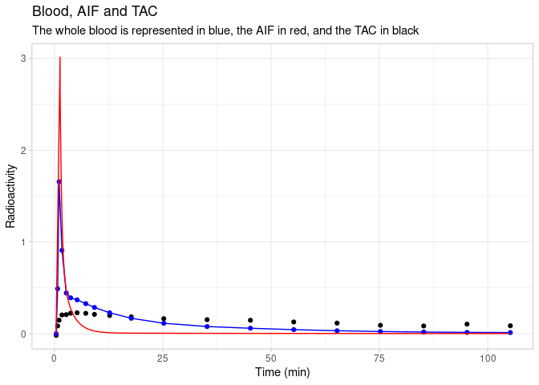<!-- -->


## Simulation Data

Now, let's explore some of the characteristics of the simulation. 

### Measurement Error

First, let's look at measurement error.  This is simulated from the fitted spline.  Let's examine the values of the measurement error SD over the course of the single TAC above.


```r
subjdat %>% 
  mutate(Sigma_Percentage = 100*(exp(sigwig))) %>% 
  ggplot(aes(x=t_tac, y=Sigma_Percentage)) +
  geom_point() +
  geom_line() +
  geom_hline(aes(yintercept=100), linetype="dashed") +
  labs(x="Time (min)",
       y="Measurement Error (%)",
       title="Measurement error function",
       subtitle="Measurement error as a percentage of the mean value across the PET measurement")
```

<!-- -->

This function is partially related to the durations of the frames, but not completely.


```r
ggplot(data=subjdat, aes(x=t_tac, y=durations)) +
  geom_point() +
  geom_line() +
  labs(x="Time (min)",
       y="Frame Duration (min)",
       title="Frame durations",
       subtitle="Frame durations over the course of the PET measurement")
```

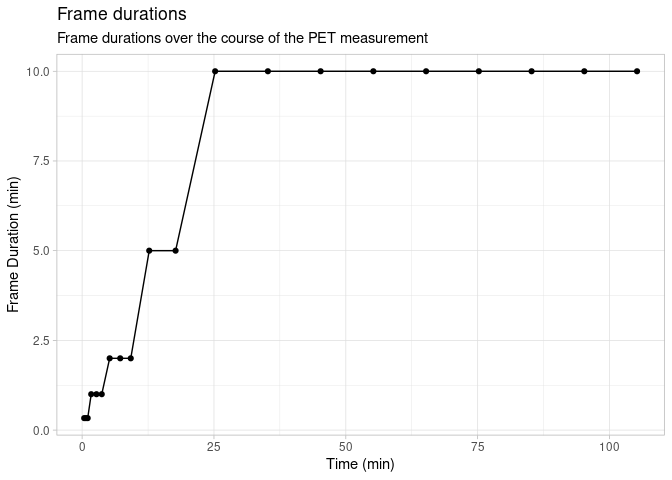<!-- -->


The true sigma at each point in time is taken from the addition of the true sigma for each ROI and individual, `sigma_true`, and adding `sigwig` (the sigma wiggly function), to make `sigma_w_true`.

Let's show this represented around the TAC.


```r
subjdat %>% 
  select(t_tac, Measured = TAC, True = TAC_true, sigma = sigma_w_true) %>% 
  mutate(sigma = exp(sigma)) %>% 
  ggplot(aes(x=t_tac, y=Measured)) +
  geom_point(size=3, aes(y=True)) + 
  geom_errorbar(aes(ymax = True + 1.96*sigma, ymin = True - 1.96*sigma)) +
  geom_point(colour="red", size=3, shape=8) + 
  geom_line(aes(y=True), linetype="dashed") +
  labs(title="True and measured TACs and measurement error",
       subtitle="True TAC and the measurement error in black, with the measured TAC in red",
       x = "Time (min)",
       y = "Radioactivity")
```

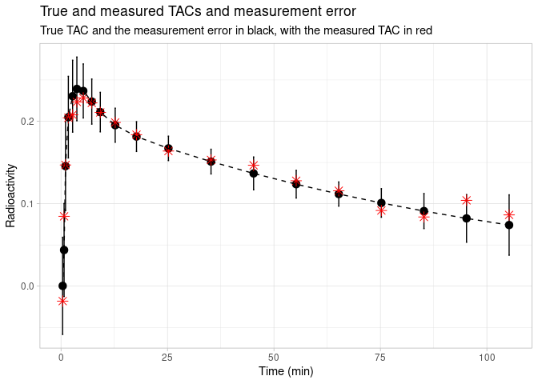<!-- -->

### Parameters by Region

The true parameters are included as simulated from the model.  Here I'll make a data frame with only the parameters.


```r
pardat <- simdat %>% 
  filter(!duplicated(paste0(WAYID, Region))) %>% 
  select(WAYID, Region, contains("_true"), Group) %>% 
  select(-TAC_true, -sigma_w_true) %>% 
  gather(Parameter, Value, -WAYID, -Region, -Group) %>% 
  mutate(Value = exp(Value),
         Parameter = str_remove(Parameter, "log"),
         Parameter = str_remove(Parameter, "_true"),
         Parameter = fct_inorder(Parameter))

pardat_wide <- simdat %>% 
  filter(!duplicated(paste0(WAYID, Region))) %>% 
  select(WAYID, Region, contains("_true"), Group) %>% 
  select(-TAC_true, -sigma_w_true)
```

Let's look at the differences between true parameters in the different regions.


```r
ggplot(pardat, aes(x=Value, colour=Region, fill=Region)) + 
  geom_histogram(alpha=0.4) +
  facet_grid(Region ~ Parameter, scales="free") +
  theme(axis.text.x = element_text(angle = 45, vjust = 0.5, hjust=1))
```

```
## `stat_bin()` using `bins = 30`. Pick better value with `binwidth`.
```

<!-- -->


Note the regions are as follows:

* acn : anterior cingulate cortex
* amy : amygdala
* cin : posterior cingulate cortex
* dor : dorsolateral prefrontal cortex
* hip : hippocampus
* ins : insula
* med : medial prefrontal cortex
* pip : parahippocampal cortex
* WAY_rphelpscs_c : dorsal raphe nucleus


### Parameters by Group

There are only group differences in BP~ND~, which are the same across all regions: 20%. Let's take a look by looking at only the DLPFC ROI.


```r
parroidat <- pardat %>% 
  filter(Region=="dor")
```

Let's look at the differences between true parameters in the different regions.


```r
ggplot(parroidat, aes(x=Group, y=Value, colour=Group, fill=Group)) + 
  geom_violin(alpha=0.4) +
  geom_beeswarm() +
  facet_wrap(~Parameter, scales="free")
```

<!-- -->

This really speaks to the difficulty of sampling variation... Really hard to see anything at all there in BP~ND~ in this particular sample.


# Conventional Analysis

We would usually model these TACs using nonlinear least squares, and then perform statistical inference.  Let's do that for comparison here.  First, we need to define the model in R code.


```r
two_compartment_log = function(logk1, logvnd, logbpnd, logk4, logvb, time, 
                               t0_aif, b_aif, 
                               lambda1_aif, lambda2_aif, lambda3_aif, 
                               A1_aif, A2_aif, A3_aif, tstar_aif, 
                               bloodval){
  
  
  k1 = exp(logk1)
  vnd = exp(logvnd)
  bpnd = exp(logbpnd)
  k4 = exp(logk4)
  vb = exp(logvb)
  
  k2 = k1 / vnd
  k3 = bpnd * k4
  
  R1 = 0.5 * (k2 + k3 + k4 + sqrt((k2 + k3 + k4)^2 - 4 * k2 * k4))
  R2 = 0.5 * (k2 + k3 + k4 - sqrt((k2 + k3 + k4)^2 - 4 * k2 * k4))
  L1 = (k1 * (R1 - k3 - k4))/(R1 - R2)
  L2 = (k1 * (k3 + k4 - R2))/(R1 - R2)
  
  time <- time - t0_aif
  tstar_aif <- tstar_aif - t0_aif
  
  out <- (time>0)*((1-vb)*
                     
   ((time<tstar_aif)*(b_aif*L1*(exp(-R1*time)/R1^2 + time/R1 - 1/R1^2) +
                        b_aif*L2*(exp(-R2*time)/R2^2 + time/R2 - 1/R2^2)) +
      
      (time>=tstar_aif)*(b_aif*L1*exp(-R1*time)*(tstar_aif/R1*exp(R1*tstar_aif) - 
                                                   1/R1^2*exp(R1*tstar_aif) + 
                                                   1/R1^2) + 
         L1*A1_aif*(exp(-lambda1_aif*time)/(R1-lambda1_aif) -
                      exp(R1*tstar_aif-R1*time-lambda1_aif*tstar_aif)/(R1-lambda1_aif)) +
         L1*A2_aif*(exp(-lambda2_aif*time)/(R1-lambda2_aif) -
                      exp(R1*tstar_aif-R1*time-lambda2_aif*tstar_aif)/(R1-lambda2_aif)) +
         L1*A3_aif*(exp(-lambda3_aif*time)/(R1-lambda3_aif) -
                      exp(R1*tstar_aif-R1*time-lambda3_aif*tstar_aif)/(R1-lambda3_aif)) +
         b_aif*L2*exp(-R2*time)*(tstar_aif/R2*exp(R2*tstar_aif) - 
                                   1/R2^2*exp(R2*tstar_aif) + 1/R2^2) +
         L2*A1_aif*(exp(-lambda1_aif*time)/(R2-lambda1_aif) -
                      exp(R2*tstar_aif-R2*time-lambda1_aif*tstar_aif)/(R2-lambda1_aif)) +
         L2*A2_aif*(exp(-lambda2_aif*time)/(R2-lambda2_aif) -
                      exp(R2*tstar_aif-R2*time-lambda2_aif*tstar_aif)/(R2-lambda2_aif)) +
         L2*A3_aif*(exp(-lambda3_aif*time)/(R2-lambda3_aif) -
                      exp(R2*tstar_aif-R2*time-lambda3_aif*tstar_aif)/(R2-lambda3_aif)))) + 
                     vb*bloodval)
  
  out <- as.numeric(out)
  
  return(out)
}
```

Now, we calculate model weights.


```r
nls_simdat_wide <- simdat %>% 
    pivot_wider(names_from = Region, values_from = TAC, id_cols = c(WAYID, t_tac, durations)) %>% 
    group_by(WAYID) %>% 
    nest() %>% 
    mutate(weights = map(data, ~kinfitr::weights_create(
      t_start = .x$t_tac - 0.5*.x$durations,
      t_end   = .x$t_tac + 0.5*.x$durations,
      tac = abs(.x$dor), radioisotope = "C11"
    ))) %>% 
    unnest(c(data, weights)) %>% 
    pivot_longer(cols = dor:WAY_rphelpscs_c, names_to = "Region", values_to = "TAC") %>% 
    ungroup()
```

... and then bind them to the data


```r
nls_simdat <- left_join(nls_simdat_wide, simdat, by=c("WAYID", "t_tac", 
                                                    "durations", "Region", 
                                                    "TAC")) %>% 
    group_by(WAYID, Region) %>% 
    nest() %>% 
    mutate(weightsvals = map(data, ~pull(.x, weights)))
```

Now we're ready to fit the TACs.  I fit them with multiple starting values (10 fits per TAC), to try to avoid falling into a local minimum.


```r
nls_simdat <- nls_simdat %>%
  mutate(fit = map(data, ~nls.multstart::nls_multstart(
    TAC ~ two_compartment_log(logk1, logvnd, logbpnd, logk4, logvb,
                              t_tac, t0, slope,
                              alpha, beta, gamma,
                              A, B, C, peaktime,
                              meanblood), data = .x,
    start_lower = c(logk1=-3, logvnd=-1.5, logbpnd=1.5, logk4=-4.5, logvb=-4.5),
    start_upper = c(logk1=-2, logvnd=-0.5, logbpnd=2.5, logk4=-3.5, logvb=-3.5),
    upper = c(logk1=0, logvnd=1, logbpnd=3.5, logk4=-1, logvb=-2.5),
    lower = c(logk1=-6, logvnd=-4, logbpnd=-1, logk4=-4, logvb=-7),
    modelweights = weights, iter=10, supp_errors = "Y")))
```

Now, let's extract the values


```r
nls_simres <- nls_simdat %>% 
    mutate(coef = map(fit, ~as.data.frame(as.list(coef(.x))))) %>% 
    ungroup() %>% 
    unnest(coef) %>% 
    mutate(logvt = log( exp(logvnd)*(1 + exp(logbpnd)) ),
           logbpp = log( exp(logvnd)*(exp(logbpnd)) ),
           Group = map_chr(data, ~.x$Group[1])) %>% 
    select(WAYID, Region, logk1:Group)
  
truevals <- nls_simdat %>% 
    select(WAYID, Region, data) %>% 
    unnest(data) %>% 
    filter(!duplicated(paste0(Region, WAYID))) %>% 
    select(WAYID, Region, ends_with("_true")) %>% 
    select(-TAC_true) %>% 
    mutate(logVt_true = log( exp(logVnd_true)*(1 + exp(logBPnd_true)) ),
           logBPp_true = log( exp(logVnd_true)*(exp(logBPnd_true))) )
  
nls_simres <- nls_simres %>% 
    left_join(truevals)
```

```
## Joining, by = c("WAYID", "Region")
```


## Comparison to true values

Let's see how well we've estimated the binding. 

### BP~ND~

We expect BP~ND~ to have been estimated rather poorly.


```r
ggplot(nls_simres, aes(x=logBPnd_true, y=logbpnd, colour=Region)) + 
  geom_point() +
  facet_wrap(~Region, scales="free") + 
  geom_smooth(method="lm", se=FALSE)
```

```
## `geom_smooth()` using formula 'y ~ x'
```

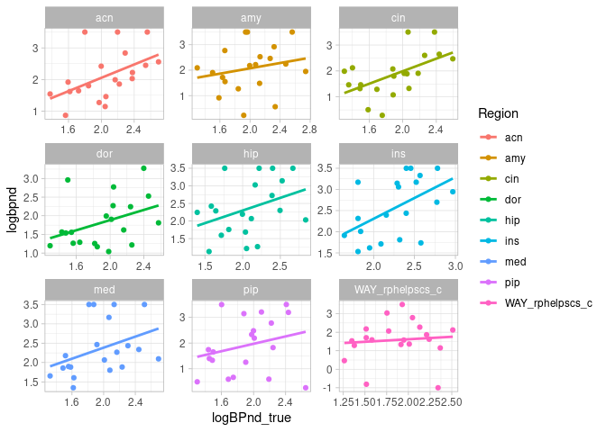<!-- -->

```r
nls_simres %>% 
  group_by(Region) %>% 
  summarise(cor = cor(logBPnd_true, logbpnd))
```

<div data-pagedtable="false">
  <script data-pagedtable-source type="application/json">
{"columns":[{"label":["Region"],"name":[1],"type":["chr"],"align":["left"]},{"label":["cor"],"name":[2],"type":["dbl"],"align":["right"]}],"data":[{"1":"acn","2":"0.50066781"},{"1":"amy","2":"0.21416701"},{"1":"cin","2":"0.54672897"},{"1":"dor","2":"0.38746860"},{"1":"hip","2":"0.36012907"},{"1":"ins","2":"0.52313273"},{"1":"med","2":"0.38706347"},{"1":"pip","2":"0.25393906"},{"1":"WAY_rphelpscs_c","2":"0.09208155"}],"options":{"columns":{"min":{},"max":[10]},"rows":{"min":[10],"max":[10]},"pages":{}}}
  </script>
</div>
The correlations are rather weak.


### BP~P~

Now we check BP~P~, where we expect the correlations to be a bit stronger.


```r
ggplot(nls_simres, aes(x=logBPp_true, y=logbpp, colour=Region)) + 
  geom_point() +
  facet_wrap(~Region, scales="free") + 
  geom_smooth(method="lm", se=FALSE)
```

```
## `geom_smooth()` using formula 'y ~ x'
```

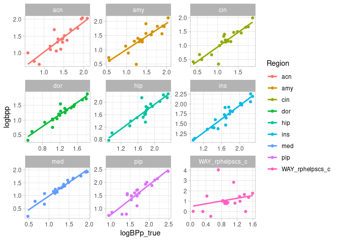<!-- -->

```r
nls_simres %>% 
  group_by(Region) %>% 
  summarise(cor = cor(logBPp_true, logbpp))
```

<div data-pagedtable="false">
  <script data-pagedtable-source type="application/json">
{"columns":[{"label":["Region"],"name":[1],"type":["chr"],"align":["left"]},{"label":["cor"],"name":[2],"type":["dbl"],"align":["right"]}],"data":[{"1":"acn","2":"0.8868790"},{"1":"amy","2":"0.8560497"},{"1":"cin","2":"0.9049722"},{"1":"dor","2":"0.9525428"},{"1":"hip","2":"0.9135842"},{"1":"ins","2":"0.9490146"},{"1":"med","2":"0.9673026"},{"1":"pip","2":"0.9048943"},{"1":"WAY_rphelpscs_c","2":"0.2689328"}],"options":{"columns":{"min":{},"max":[10]},"rows":{"min":[10],"max":[10]},"pages":{}}}
  </script>
</div>
Much better!

### V~T~

Lastly, let's check V~T~, where we expect the correlations to be very strong.


```r
ggplot(nls_simres, aes(x=logVt_true, y=logvt, colour=Region)) + 
  geom_point() +
  facet_wrap(~Region, scales="free") + 
  geom_smooth(method="lm", se=FALSE)
```

```
## `geom_smooth()` using formula 'y ~ x'
```

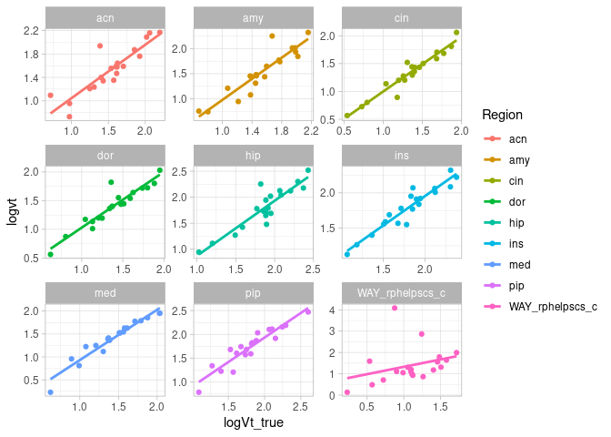<!-- -->

```r
nls_simres %>% 
  group_by(Region) %>% 
  summarise(cor = cor(logVt_true, logvt))
```

<div data-pagedtable="false">
  <script data-pagedtable-source type="application/json">
{"columns":[{"label":["Region"],"name":[1],"type":["chr"],"align":["left"]},{"label":["cor"],"name":[2],"type":["dbl"],"align":["right"]}],"data":[{"1":"acn","2":"0.8856074"},{"1":"amy","2":"0.9159126"},{"1":"cin","2":"0.9632339"},{"1":"dor","2":"0.9373832"},{"1":"hip","2":"0.9045355"},{"1":"ins","2":"0.9471486"},{"1":"med","2":"0.9641917"},{"1":"pip","2":"0.9366847"},{"1":"WAY_rphelpscs_c","2":"0.3090955"}],"options":{"columns":{"min":{},"max":[10]},"rows":{"min":[10],"max":[10]},"pages":{}}}
  </script>
</div>


## Statistics

Next, we move to statistical comparison.

### t-tests

For the comparisons below, the difference is calculated as Group1 - Group2, so it should be negative.


#### BP~ND~

Let's run tests for BP~ND~ first.


```r
nls_simres_t_bpnd <- nls_simres %>% 
  group_by(Region) %>% 
  nest() %>% 
  mutate(res = map(data, ~broom::glance(t.test(logbpnd ~ Group, data=.x)))) %>% 
  select(Region, res) %>% 
  unnest(res)

nls_simres_t_bpnd
```

<div data-pagedtable="false">
  <script data-pagedtable-source type="application/json">
{"columns":[{"label":["Region"],"name":[1],"type":["chr"],"align":["left"]},{"label":["estimate"],"name":[2],"type":["dbl"],"align":["right"]},{"label":["estimate1"],"name":[3],"type":["dbl"],"align":["right"]},{"label":["estimate2"],"name":[4],"type":["dbl"],"align":["right"]},{"label":["statistic"],"name":[5],"type":["dbl"],"align":["right"]},{"label":["p.value"],"name":[6],"type":["dbl"],"align":["right"]},{"label":["parameter"],"name":[7],"type":["dbl"],"align":["right"]},{"label":["conf.low"],"name":[8],"type":["dbl"],"align":["right"]},{"label":["conf.high"],"name":[9],"type":["dbl"],"align":["right"]},{"label":["method"],"name":[10],"type":["chr"],"align":["left"]},{"label":["alternative"],"name":[11],"type":["chr"],"align":["left"]}],"data":[{"1":"dor","2":"-0.220782136","3":"1.713053","4":"1.933835","5":"-0.743091449","6":"0.46813356","7":"16.09713","8":"-0.8503248","9":"0.4087606","10":"Welch Two Sample t-test","11":"two.sided"},{"1":"med","2":"0.319237009","3":"2.506593","4":"2.187356","5":"1.016715296","6":"0.32390495","7":"16.57050","8":"-0.3445314","9":"0.9830055","10":"Welch Two Sample t-test","11":"two.sided"},{"1":"hip","2":"-0.118444394","3":"2.296286","4":"2.414730","5":"-0.324853327","6":"0.74903869","7":"17.99306","8":"-0.8844803","9":"0.6475915","10":"Welch Two Sample t-test","11":"two.sided"},{"1":"amy","2":"0.544268653","3":"2.346188","4":"1.801919","5":"1.344244408","6":"0.19831994","7":"15.41453","8":"-0.3167131","9":"1.4052504","10":"Welch Two Sample t-test","11":"two.sided"},{"1":"pip","2":"-0.408698312","3":"1.702514","4":"2.111212","5":"-0.841338334","6":"0.41125761","7":"17.90012","8":"-1.4296750","9":"0.6122784","10":"Welch Two Sample t-test","11":"two.sided"},{"1":"ins","2":"0.526472613","3":"2.838090","4":"2.311617","5":"1.756161925","6":"0.09813545","7":"16.03815","8":"-0.1089223","9":"1.1618675","10":"Welch Two Sample t-test","11":"two.sided"},{"1":"acn","2":"-0.001673618","3":"2.105855","4":"2.107529","5":"-0.004713968","6":"0.99629277","7":"17.29082","8":"-0.7497706","9":"0.7464234","10":"Welch Two Sample t-test","11":"two.sided"},{"1":"cin","2":"-0.171986947","3":"1.771820","4":"1.943807","5":"-0.452032487","6":"0.65664547","7":"17.99998","8":"-0.9713348","9":"0.6273609","10":"Welch Two Sample t-test","11":"two.sided"},{"1":"WAY_rphelpscs_c","2":"0.677004036","3":"1.921450","4":"1.244446","5":"1.420489210","6":"0.17669607","7":"14.44070","8":"-0.3422807","9":"1.6962888","10":"Welch Two Sample t-test","11":"two.sided"}],"options":{"columns":{"min":{},"max":[10]},"rows":{"min":[10],"max":[10]},"pages":{}}}
  </script>
</div>

```r
ggplot(nls_simres_t_bpnd, aes(x=Region, y=estimate)) +
  geom_point() + 
  geom_errorbar(aes(ymin=conf.low, ymax=conf.high)) +
  geom_hline(yintercept=-0.182, colour="red", linetype="dashed") +
  coord_flip()
```

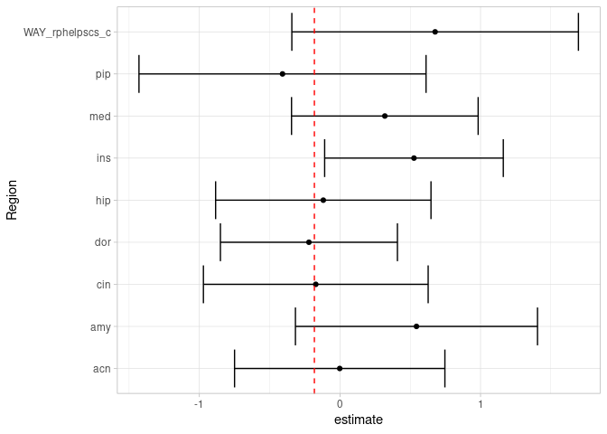<!-- -->

#### BP~P~

Let's also try BP~P~, which should be estimated a bit better


```r
nls_simres_t_bpp <- nls_simres %>% 
  group_by(Region) %>% 
  nest() %>% 
  mutate(res = map(data, ~broom::glance(t.test(logbpp ~ Group, data=.x)))) %>% 
  select(Region, res) %>% 
  unnest(res)

nls_simres_t_bpp
```

<div data-pagedtable="false">
  <script data-pagedtable-source type="application/json">
{"columns":[{"label":["Region"],"name":[1],"type":["chr"],"align":["left"]},{"label":["estimate"],"name":[2],"type":["dbl"],"align":["right"]},{"label":["estimate1"],"name":[3],"type":["dbl"],"align":["right"]},{"label":["estimate2"],"name":[4],"type":["dbl"],"align":["right"]},{"label":["statistic"],"name":[5],"type":["dbl"],"align":["right"]},{"label":["p.value"],"name":[6],"type":["dbl"],"align":["right"]},{"label":["parameter"],"name":[7],"type":["dbl"],"align":["right"]},{"label":["conf.low"],"name":[8],"type":["dbl"],"align":["right"]},{"label":["conf.high"],"name":[9],"type":["dbl"],"align":["right"]},{"label":["method"],"name":[10],"type":["chr"],"align":["left"]},{"label":["alternative"],"name":[11],"type":["chr"],"align":["left"]}],"data":[{"1":"dor","2":"-0.11036930","3":"1.174343","4":"1.2847119","5":"-0.6225838","6":"0.5433772","7":"14.27342","8":"-0.4899068","9":"0.2691682","10":"Welch Two Sample t-test","11":"two.sided"},{"1":"med","2":"-0.19890154","3":"1.207257","4":"1.4061586","5":"-1.0503853","6":"0.3113211","7":"14.01142","8":"-0.6050085","9":"0.2072054","10":"Welch Two Sample t-test","11":"two.sided"},{"1":"hip","2":"-0.08902813","3":"1.644768","4":"1.7337959","5":"-0.4838421","6":"0.6352969","7":"15.42108","8":"-0.4802894","9":"0.3022332","10":"Welch Two Sample t-test","11":"two.sided"},{"1":"amy","2":"-0.03886953","3":"1.360125","4":"1.3989950","5":"-0.1920802","6":"0.8498322","7":"17.97886","8":"-0.4640500","9":"0.3863109","10":"Welch Two Sample t-test","11":"two.sided"},{"1":"pip","2":"-0.30920691","3":"1.389264","4":"1.6984712","5":"-1.4664651","6":"0.1677072","7":"12.25524","8":"-0.7675547","9":"0.1491409","10":"Welch Two Sample t-test","11":"two.sided"},{"1":"ins","2":"-0.14714094","3":"1.621516","4":"1.7686570","5":"-0.9775821","6":"0.3416123","7":"17.48706","8":"-0.4640278","9":"0.1697459","10":"Welch Two Sample t-test","11":"two.sided"},{"1":"acn","2":"-0.11263757","3":"1.339413","4":"1.4520506","5":"-0.6380125","6":"0.5317149","7":"17.52426","8":"-0.4842668","9":"0.2589916","10":"Welch Two Sample t-test","11":"two.sided"},{"1":"cin","2":"-0.28841416","3":"1.004106","4":"1.2925198","5":"-1.4934231","6":"0.1540056","7":"16.67599","8":"-0.6964717","9":"0.1196434","10":"Welch Two Sample t-test","11":"two.sided"},{"1":"WAY_rphelpscs_c","2":"0.25484150","3":"1.242727","4":"0.9878854","5":"0.5557751","6":"0.5855907","7":"17.03518","8":"-0.7124274","9":"1.2221104","10":"Welch Two Sample t-test","11":"two.sided"}],"options":{"columns":{"min":{},"max":[10]},"rows":{"min":[10],"max":[10]},"pages":{}}}
  </script>
</div>

```r
ggplot(nls_simres_t_bpp, aes(x=Region, y=estimate)) +
  geom_point() + 
  geom_errorbar(aes(ymin=conf.low, ymax=conf.high)) +
  geom_hline(yintercept=-0.182, colour="red", linetype="dashed") +
  coord_flip()
```

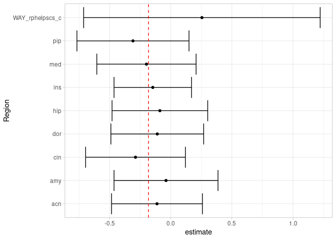<!-- -->

These are a bit closer, but the 95% CIs around the estimates are very wide...


## LME

In order to improve our estimation, we can use linear mixed effects models.

### BP~ND~

We expect BP~ND~ to be estimated poorly


```r
nls_simres_lme_bpnd <- broom.mixed::tidy(lmerTest::lmer(logbpnd ~ 1 + Region + Group + (1|WAYID), 
                                                  data=nls_simres))

nls_simres_lme_bpnd
```

<div data-pagedtable="false">
  <script data-pagedtable-source type="application/json">
{"columns":[{"label":["effect"],"name":[1],"type":["chr"],"align":["left"]},{"label":["group"],"name":[2],"type":["chr"],"align":["left"]},{"label":["term"],"name":[3],"type":["chr"],"align":["left"]},{"label":["estimate"],"name":[4],"type":["dbl"],"align":["right"]},{"label":["std.error"],"name":[5],"type":["dbl"],"align":["right"]},{"label":["statistic"],"name":[6],"type":["dbl"],"align":["right"]},{"label":["df"],"name":[7],"type":["dbl"],"align":["right"]},{"label":["p.value"],"name":[8],"type":["dbl"],"align":["right"]}],"data":[{"1":"fixed","2":"NA","3":"(Intercept)","4":"2.1703252","5":"0.2175979","6":"9.9740181","7":"76.49237","8":"1.737127e-15"},{"1":"fixed","2":"NA","3":"Regionamy","4":"-0.0326387","5":"0.2429248","6":"-0.1343572","7":"152.00000","8":"8.932978e-01"},{"1":"fixed","2":"NA","3":"Regioncin","4":"-0.2488786","5":"0.2429248","6":"-1.0245088","7":"152.00000","8":"3.072227e-01"},{"1":"fixed","2":"NA","3":"Regiondor","4":"-0.2832478","5":"0.2429248","6":"-1.1659898","7":"152.00000","8":"2.454449e-01"},{"1":"fixed","2":"NA","3":"Regionhip","4":"0.2488161","5":"0.2429248","6":"1.0242517","7":"152.00000","8":"3.073437e-01"},{"1":"fixed","2":"NA","3":"Regionins","4":"0.4681612","5":"0.2429248","6":"1.9271860","7":"152.00000","8":"5.582168e-02"},{"1":"fixed","2":"NA","3":"Regionmed","4":"0.2402828","5":"0.2429248","6":"0.9891242","7":"152.00000","8":"3.241743e-01"},{"1":"fixed","2":"NA","3":"Regionpip","4":"-0.1998290","5":"0.2429248","6":"-0.8225962","7":"152.00000","8":"4.120263e-01"},{"1":"fixed","2":"NA","3":"RegionWAY_rphelpscs_c","4":"-0.5237441","5":"0.2429248","6":"-2.1559930","7":"152.00000","8":"3.265743e-02"},{"1":"fixed","2":"NA","3":"GroupPatient","4":"-0.1272663","5":"0.2055290","6":"-0.6192135","7":"18.00000","8":"5.435343e-01"},{"1":"ran_pars","2":"WAYID","3":"sd__(Intercept)","4":"0.3816300","5":"NA","6":"NA","7":"NA","8":"NA"},{"1":"ran_pars","2":"Residual","3":"sd__Observation","4":"0.7681956","5":"NA","6":"NA","7":"NA","8":"NA"}],"options":{"columns":{"min":{},"max":[10]},"rows":{"min":[10],"max":[10]},"pages":{}}}
  </script>
</div>

```r
nls_simres_lme_bpnd %>% 
  filter(term=="GroupPatient") %>% 
  ggplot(aes(x=term, y=estimate)) +
  geom_point() + 
  geom_errorbar(aes(ymin = estimate + 1.96*std.error, 
                    ymax = estimate - 1.96*std.error)) +
  geom_hline(yintercept=0.182, colour="red", linetype="dashed") +
  coord_flip()
```

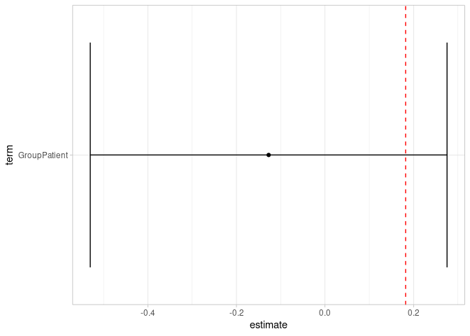<!-- -->


### BP~P~

We expect BP~P~ to be estimated reasonably well.


```r
nls_simres_lme_bpp <- broom.mixed::tidy(lmerTest::lmer(logbpp ~ 1 + Region + Group + (1|WAYID), 
                                                  data=nls_simres))

nls_simres_lme_bpp
```

<div data-pagedtable="false">
  <script data-pagedtable-source type="application/json">
{"columns":[{"label":["effect"],"name":[1],"type":["chr"],"align":["left"]},{"label":["group"],"name":[2],"type":["chr"],"align":["left"]},{"label":["term"],"name":[3],"type":["chr"],"align":["left"]},{"label":["estimate"],"name":[4],"type":["dbl"],"align":["right"]},{"label":["std.error"],"name":[5],"type":["dbl"],"align":["right"]},{"label":["statistic"],"name":[6],"type":["dbl"],"align":["right"]},{"label":["df"],"name":[7],"type":["dbl"],"align":["right"]},{"label":["p.value"],"name":[8],"type":["dbl"],"align":["right"]}],"data":[{"1":"fixed","2":"NA","3":"(Intercept)","4":"1.33796925","5":"0.1431832","6":"9.3444541","7":"37.8978","8":"2.228683e-11"},{"1":"fixed","2":"NA","3":"Regionamy","4":"-0.01617161","5":"0.1214307","6":"-0.1331757","7":"152.0000","8":"8.942306e-01"},{"1":"fixed","2":"NA","3":"Regioncin","4":"-0.24741914","5":"0.1214307","6":"-2.0375342","7":"152.0000","8":"4.333101e-02"},{"1":"fixed","2":"NA","3":"Regiondor","4":"-0.16620461","5":"0.1214307","6":"-1.3687202","7":"152.0000","8":"1.731062e-01"},{"1":"fixed","2":"NA","3":"Regionhip","4":"0.29355004","5":"0.1214307","6":"2.4174291","7":"152.0000","8":"1.681436e-02"},{"1":"fixed","2":"NA","3":"Regionins","4":"0.29935467","5":"0.1214307","6":"2.4652312","7":"152.0000","8":"1.480514e-02"},{"1":"fixed","2":"NA","3":"Regionmed","4":"-0.08902402","5":"0.1214307","6":"-0.7331263","7":"152.0000","8":"4.646105e-01"},{"1":"fixed","2":"NA","3":"Regionpip","4":"0.14813586","5":"0.1214307","6":"1.2199213","7":"152.0000","8":"2.243841e-01"},{"1":"fixed","2":"NA","3":"RegionWAY_rphelpscs_c","4":"-0.28042574","5":"0.1214307","6":"-2.3093485","7":"152.0000","8":"2.227085e-02"},{"1":"fixed","2":"NA","3":"GroupPatient","4":"0.11552518","5":"0.1670205","6":"0.6916825","7":"18.0000","8":"4.979622e-01"},{"1":"ran_pars","2":"WAYID","3":"sd__(Intercept)","4":"0.35084966","5":"NA","6":"NA","7":"NA","8":"NA"},{"1":"ran_pars","2":"Residual","3":"sd__Observation","4":"0.38399750","5":"NA","6":"NA","7":"NA","8":"NA"}],"options":{"columns":{"min":{},"max":[10]},"rows":{"min":[10],"max":[10]},"pages":{}}}
  </script>
</div>

```r
nls_simres_lme_bpp %>% 
  filter(term=="GroupPatient") %>% 
  ggplot(aes(x=term, y=estimate)) +
  geom_point() + 
  geom_errorbar(aes(ymin = estimate + 1.96*std.error, 
                    ymax = estimate - 1.96*std.error)) +
  geom_hline(yintercept=0.182, colour="red", linetype="dashed") +
  coord_flip()
```

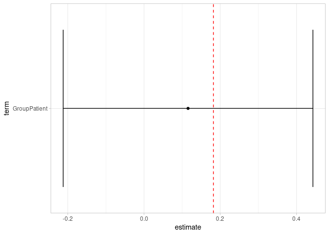<!-- -->
And our estimate is much closer to reality.


# SiMBA

Now, we would like to run SiMBA on this data.  We can generate the first version of the STAN code using `brms`.

## Preparation with brms

### Function

First, the 2TC function


```r
two_compartment_log_stan <- "
      real twotcm_log_stan(real logK1, real logVnd, real logBPnd, 
                          real logk4, real logvB, real time,
                          real t0_aif, real b_aif, real lambda1_aif, 
                          real lambda2_aif, real lambda3_aif, 
                          real A1_aif, real A2_aif, real A3_aif, 
                          real tstar_aif, real bloodval) {
      
          real K1;
          real k2;
          real k3;
          real k4;
          real Vnd;
          real BPnd;
          real vB;
          
          real R1;
          real R2;
          real L1;
          real L2;
          
          int indicatort0;
          int indicatorpeak;
          
          real timesincet0;
          real tstaraftert0;
          
          real pred;
          
          indicatort0 = time > t0_aif;
          indicatorpeak = time > tstar_aif;
          
      
          
          K1 = exp(logK1);
          Vnd = exp(logVnd);
          BPnd = exp(logBPnd);
          k4 = exp(logk4);
          vB = exp(logvB);
          
          k2 = K1 / Vnd;
          k3 = k4 * BPnd;
        
          R1 = 0.5 * (k2 + k3 + k4 + sqrt((k2 + k3 + k4)^2 - 4 * k2 * k4));
          R2 = 0.5 * (k2 + k3 + k4 - sqrt((k2 + k3 + k4)^2 - 4 * k2 * k4));
      
          L1 = (K1 * (R1 - k3 - k4))/(R1 - R2);
          L2 = (K1 * (k3 + k4 - R2))/(R1 - R2);
          
          timesincet0 = time - t0_aif;
          tstaraftert0 = tstar_aif - t0_aif;
        
        pred =  (indicatort0)*((1-vB)*  // whole thing is zero, if before t0
            
             ((-1*(indicatorpeak-1))*(b_aif*L1*(exp(-R1*timesincet0)/R1^2 + timesincet0/R1 - 1/R1^2) +
             b_aif*L2*(exp(-R2*timesincet0)/R2^2 + timesincet0/R2 - 1/R2^2)) +
             
             (indicatorpeak)*(b_aif*L1*exp(-R1*timesincet0)*(tstaraftert0/R1*exp(R1*tstaraftert0) - 
             1/R1^2*exp(R1*tstaraftert0) + 
             1/R1^2) + 
             L1*A1_aif*(exp(-lambda1_aif*timesincet0)/(R1-lambda1_aif) -
             exp(R1*tstaraftert0-R1*timesincet0-lambda1_aif*tstaraftert0)/(R1-lambda1_aif)) +
             L1*A2_aif*(exp(-lambda2_aif*timesincet0)/(R1-lambda2_aif) -
             exp(R1*tstaraftert0-R1*timesincet0-lambda2_aif*tstaraftert0)/(R1-lambda2_aif)) +
             L1*A3_aif*(exp(-lambda3_aif*timesincet0)/(R1-lambda3_aif) -
             exp(R1*tstaraftert0-R1*timesincet0-lambda3_aif*tstaraftert0)/(R1-lambda3_aif)) +
             b_aif*L2*exp(-R2*timesincet0)*(tstaraftert0/R2*exp(R2*tstaraftert0) - 
             1/R2^2*exp(R2*tstaraftert0) + 1/R2^2) +
             L2*A1_aif*(exp(-lambda1_aif*timesincet0)/(R2-lambda1_aif) -
             exp(R2*tstaraftert0-R2*timesincet0-lambda1_aif*tstaraftert0)/(R2-lambda1_aif)) +
             L2*A2_aif*(exp(-lambda2_aif*timesincet0)/(R2-lambda2_aif) -
             exp(R2*tstaraftert0-R2*timesincet0-lambda2_aif*tstaraftert0)/(R2-lambda2_aif)) +
             L2*A3_aif*(exp(-lambda3_aif*timesincet0)/(R2-lambda3_aif) -
             exp(R2*tstaraftert0-R2*timesincet0-lambda3_aif*tstaraftert0)/(R2-lambda3_aif)))) + 
             
             vB*bloodval);
             
        return(pred);
      }
      "
```

### Formula


```r
twotcm_formula <- bf( TAC ~ twotcm_log_stan(logK1, logVnd, logBPnd, logk4, 
                                                  logvB, t_tac, 
                                                  t0, slope, 
                                                  alpha, beta, gamma, 
                                                  A, B, C, peaktime, 
                                                  meanblood),
                            lf(sigma ~ 1 + s(t_tac) + (1 | Region) + 
                                 (1 | WAYID), center = FALSE),
                            # Nonlinear variables
                            logK1 ~ 1 + Region + (1|k|WAYID) + 
                              (1|l|WAYID:Region),
                            logBPnd ~  1 + Region + Group + (1|k|WAYID) + 
                              (1|l|WAYID:Region),
                            logVnd ~ 1 + (1|m|Region) + (1|k|WAYID) +
                              (1|l|WAYID:Region),
                            logk4 ~ 1 + (1|m|Region) + (1|k|WAYID) +
                              (1|l|WAYID:Region),
                            logvB ~ 1 + (1|WAYID) + (1|Region),
                            # Nonlinear fit
                            nl = TRUE, center = TRUE)
```

### Prior

This first requires making sure that the dummy variables work correctly. We'll make Region into a factor.


```r
simdat <- simdat %>% 
  mutate(Region = fct_inorder(Region))
```


```r
twotcm_prior <- c(
  set_prior("normal(-2.5, 0.25)", nlpar = "logK1"),
  set_prior("normal(-1, 0.25)", nlpar = "logVnd"),
  set_prior("normal( 2, 0.25)", nlpar = "logBPnd"),
  set_prior("normal(-4, 0.25)", nlpar = "logk4"),
  set_prior("normal(-4, 0.5)", nlpar = "logvB"),
  
  set_prior("normal(0, 0.3)", nlpar = "logK1", class = "sd", group="WAYID"),
  set_prior("normal(0, 0.3)", nlpar = "logVnd", class = "sd", group="WAYID"),
  set_prior("normal(0, 0.3)", nlpar = "logBPnd", class = "sd", group="WAYID"),
  set_prior("normal(0, 0.3)", nlpar = "logk4", class = "sd", group="WAYID"),
  set_prior("normal(0, 0.5)", nlpar = "logvB", class = "sd", group="WAYID"),
  
  set_prior("normal(0, 0.025)", nlpar = "logK1", class = "sd", group="WAYID:Region"),
  set_prior("normal(0, 0.025)", nlpar = "logVnd", class = "sd", group="WAYID:Region"),
  set_prior("normal(0, 0.025)", nlpar = "logBPnd", class = "sd", group="WAYID:Region"),
  set_prior("normal(0, 0.025)", nlpar = "logk4", class = "sd", group="WAYID:Region"),
  
  set_prior("normal(0, 0.1)", nlpar = "logVnd", class = "sd", group="Region"),
  set_prior("normal(0, 0.1)", nlpar = "logk4", class = "sd", group="Region"),
  set_prior("normal(0, 0.1)", nlpar = "logvB", class = "sd", group="Region"),
  
  set_prior("normal(0, 0.3)", coef="Regionacn", nlpar="logK1"),
  set_prior("normal(0, 0.3)", coef="Regionamy", nlpar="logK1"),
  set_prior("normal(0, 0.3)", coef="Regioncin", nlpar="logK1"),
  set_prior("normal(0, 0.3)", coef="Regionhip", nlpar="logK1"),
  set_prior("normal(0, 0.3)", coef="Regionins", nlpar="logK1"),
  set_prior("normal(0, 0.3)", coef="Regionmed", nlpar="logK1"),
  set_prior("normal(0, 0.3)", coef="Regionpip", nlpar="logK1"),
  set_prior("normal(0, 0.3)", coef="RegionWAY_rphelpscs_c", nlpar="logK1"),
  
  set_prior("normal(0, 0.3)", coef="Regionacn", nlpar="logBPnd"),
  set_prior("normal(0, 0.3)", coef="Regionamy", nlpar="logBPnd"),
  set_prior("normal(0, 0.3)", coef="Regioncin", nlpar="logBPnd"),
  set_prior("normal(0, 0.3)", coef="Regionhip", nlpar="logBPnd"),
  set_prior("normal(0, 0.3)", coef="Regionins", nlpar="logBPnd"),
  set_prior("normal(0, 0.3)", coef="Regionmed", nlpar="logBPnd"),
  set_prior("normal(0, 0.3)", coef="Regionpip", nlpar="logBPnd"),
  set_prior("normal(0, 0.3)", coef="RegionWAY_rphelpscs_c", 
            nlpar="logBPnd"),
  
  set_prior("normal(0, 0.2)", coef="GroupPatient", 
            nlpar="logBPnd"),
  
  set_prior("normal(-5, 1)", dpar = "sigma"),
  set_prior("normal(0, 0.3)", dpar = "sigma", class="sd", group="WAYID"),
  set_prior("normal(0, 0.5)", dpar = "sigma", class="sd", group="Region"),
  
  set_prior("student_t(3, 0, 4)", coef="st_tac_1", dpar = "sigma", class="b"),
  set_prior("student_t(3, 0, 2.5)", dpar = "sigma", class="sds"),
  
  set_prior("lkj(1)", class="cor", group = "WAYID"),
  set_prior("lkj(2)", class="cor", group = "Region"),
  set_prior("lkj(2)", class="cor", group = "WAYID:Region"))
```

### Fitting with `brms`

Now, at this point, we could run the model with `brms` as follows:


```r
fit <- brm(
    twotcm_formula,
    family=gaussian(), 
    data = simdat,
    prior = twotcm_prior,
    stanvars = stanvar(scode = two_compartment_log_stan, 
               block="functions"),
    backend = "cmdstanr", 
    inits = 0, 
    iter = 1000, warmup = 300,
    chains=3, cores=3)
```


However, in order to improve posterior geometry, it is preferable to use a centred parameterisation for some of the parameters. This should not affect the estimated values, but should improve the efficiency of the sampling.  Then we can run the code using `rstan` or `cmdstanr`.  I do this by saving the generated STAN code and and manually adjusting it.


### Saving and modifying the brms-generated STAN code


```r
sc <- make_stancode(formula = twotcm_formula,
    family=gaussian(), 
    data = simdat,
    prior = twotcm_prior,
    stanvars = stanvar(scode = two_compartment_log_stan, 
               block="functions"))

sc
```

```
## // generated with brms 2.15.0
## functions {
##  /* compute correlated group-level effects
##   * Args: 
##   *   z: matrix of unscaled group-level effects
##   *   SD: vector of standard deviation parameters
##   *   L: cholesky factor correlation matrix
##   * Returns: 
##   *   matrix of scaled group-level effects
##   */ 
##   matrix scale_r_cor(matrix z, vector SD, matrix L) {
##     // r is stored in another dimension order than z
##     return transpose(diag_pre_multiply(SD, L) * z);
##   }
##   
##       real twotcm_log_stan(real logK1, real logVnd, real logBPnd, 
##                           real logk4, real logvB, real time,
##                           real t0_aif, real b_aif, real lambda1_aif, 
##                           real lambda2_aif, real lambda3_aif, 
##                           real A1_aif, real A2_aif, real A3_aif, 
##                           real tstar_aif, real bloodval) {
##       
##           real K1;
##           real k2;
##           real k3;
##           real k4;
##           real Vnd;
##           real BPnd;
##           real vB;
##           
##           real R1;
##           real R2;
##           real L1;
##           real L2;
##           
##           int indicatort0;
##           int indicatorpeak;
##           
##           real timesincet0;
##           real tstaraftert0;
##           
##           real pred;
##           
##           indicatort0 = time > t0_aif;
##           indicatorpeak = time > tstar_aif;
##           
##       
##           
##           K1 = exp(logK1);
##           Vnd = exp(logVnd);
##           BPnd = exp(logBPnd);
##           k4 = exp(logk4);
##           vB = exp(logvB);
##           
##           k2 = K1 / Vnd;
##           k3 = k4 * BPnd;
##         
##           R1 = 0.5 * (k2 + k3 + k4 + sqrt((k2 + k3 + k4)^2 - 4 * k2 * k4));
##           R2 = 0.5 * (k2 + k3 + k4 - sqrt((k2 + k3 + k4)^2 - 4 * k2 * k4));
##       
##           L1 = (K1 * (R1 - k3 - k4))/(R1 - R2);
##           L2 = (K1 * (k3 + k4 - R2))/(R1 - R2);
##           
##           timesincet0 = time - t0_aif;
##           tstaraftert0 = tstar_aif - t0_aif;
##         
##         pred =  (indicatort0)*((1-vB)*  // whole thing is zero, if before t0
##             
##              ((-1*(indicatorpeak-1))*(b_aif*L1*(exp(-R1*timesincet0)/R1^2 + timesincet0/R1 - 1/R1^2) +
##              b_aif*L2*(exp(-R2*timesincet0)/R2^2 + timesincet0/R2 - 1/R2^2)) +
##              
##              (indicatorpeak)*(b_aif*L1*exp(-R1*timesincet0)*(tstaraftert0/R1*exp(R1*tstaraftert0) - 
##              1/R1^2*exp(R1*tstaraftert0) + 
##              1/R1^2) + 
##              L1*A1_aif*(exp(-lambda1_aif*timesincet0)/(R1-lambda1_aif) -
##              exp(R1*tstaraftert0-R1*timesincet0-lambda1_aif*tstaraftert0)/(R1-lambda1_aif)) +
##              L1*A2_aif*(exp(-lambda2_aif*timesincet0)/(R1-lambda2_aif) -
##              exp(R1*tstaraftert0-R1*timesincet0-lambda2_aif*tstaraftert0)/(R1-lambda2_aif)) +
##              L1*A3_aif*(exp(-lambda3_aif*timesincet0)/(R1-lambda3_aif) -
##              exp(R1*tstaraftert0-R1*timesincet0-lambda3_aif*tstaraftert0)/(R1-lambda3_aif)) +
##              b_aif*L2*exp(-R2*timesincet0)*(tstaraftert0/R2*exp(R2*tstaraftert0) - 
##              1/R2^2*exp(R2*tstaraftert0) + 1/R2^2) +
##              L2*A1_aif*(exp(-lambda1_aif*timesincet0)/(R2-lambda1_aif) -
##              exp(R2*tstaraftert0-R2*timesincet0-lambda1_aif*tstaraftert0)/(R2-lambda1_aif)) +
##              L2*A2_aif*(exp(-lambda2_aif*timesincet0)/(R2-lambda2_aif) -
##              exp(R2*tstaraftert0-R2*timesincet0-lambda2_aif*tstaraftert0)/(R2-lambda2_aif)) +
##              L2*A3_aif*(exp(-lambda3_aif*timesincet0)/(R2-lambda3_aif) -
##              exp(R2*tstaraftert0-R2*timesincet0-lambda3_aif*tstaraftert0)/(R2-lambda3_aif)))) + 
##              
##              vB*bloodval);
##              
##         return(pred);
##       }
##       
## }
## data {
##   int<lower=1> N;  // total number of observations
##   vector[N] Y;  // response variable
##   int<lower=1> K_logK1;  // number of population-level effects
##   matrix[N, K_logK1] X_logK1;  // population-level design matrix
##   int<lower=1> K_logBPnd;  // number of population-level effects
##   matrix[N, K_logBPnd] X_logBPnd;  // population-level design matrix
##   int<lower=1> K_logVnd;  // number of population-level effects
##   matrix[N, K_logVnd] X_logVnd;  // population-level design matrix
##   int<lower=1> K_logk4;  // number of population-level effects
##   matrix[N, K_logk4] X_logk4;  // population-level design matrix
##   int<lower=1> K_logvB;  // number of population-level effects
##   matrix[N, K_logvB] X_logvB;  // population-level design matrix
##   // covariate vectors for non-linear functions
##   vector[N] C_1;
##   vector[N] C_2;
##   vector[N] C_3;
##   vector[N] C_4;
##   vector[N] C_5;
##   vector[N] C_6;
##   vector[N] C_7;
##   vector[N] C_8;
##   vector[N] C_9;
##   vector[N] C_10;
##   vector[N] C_11;
##   int<lower=1> K_sigma;  // number of population-level effects
##   matrix[N, K_sigma] X_sigma;  // population-level design matrix
##   // data for splines
##   int Ks_sigma;  // number of linear effects
##   matrix[N, Ks_sigma] Xs_sigma;  // design matrix for the linear effects
##   // data for spline s(t_tac)
##   int nb_sigma_1;  // number of bases
##   int knots_sigma_1[nb_sigma_1];  // number of knots
##   // basis function matrices
##   matrix[N, knots_sigma_1[1]] Zs_sigma_1_1;
##   // data for group-level effects of ID 1
##   int<lower=1> N_1;  // number of grouping levels
##   int<lower=1> M_1;  // number of coefficients per level
##   int<lower=1> J_1[N];  // grouping indicator per observation
##   // group-level predictor values
##   vector[N] Z_1_sigma_1;
##   // data for group-level effects of ID 2
##   int<lower=1> N_2;  // number of grouping levels
##   int<lower=1> M_2;  // number of coefficients per level
##   int<lower=1> J_2[N];  // grouping indicator per observation
##   // group-level predictor values
##   vector[N] Z_2_sigma_1;
##   // data for group-level effects of ID 3
##   int<lower=1> N_3;  // number of grouping levels
##   int<lower=1> M_3;  // number of coefficients per level
##   int<lower=1> J_3[N];  // grouping indicator per observation
##   // group-level predictor values
##   vector[N] Z_3_logK1_1;
##   vector[N] Z_3_logBPnd_2;
##   vector[N] Z_3_logVnd_3;
##   vector[N] Z_3_logk4_4;
##   int<lower=1> NC_3;  // number of group-level correlations
##   // data for group-level effects of ID 4
##   int<lower=1> N_4;  // number of grouping levels
##   int<lower=1> M_4;  // number of coefficients per level
##   int<lower=1> J_4[N];  // grouping indicator per observation
##   // group-level predictor values
##   vector[N] Z_4_logK1_1;
##   vector[N] Z_4_logBPnd_2;
##   vector[N] Z_4_logVnd_3;
##   vector[N] Z_4_logk4_4;
##   int<lower=1> NC_4;  // number of group-level correlations
##   // data for group-level effects of ID 5
##   int<lower=1> N_5;  // number of grouping levels
##   int<lower=1> M_5;  // number of coefficients per level
##   int<lower=1> J_5[N];  // grouping indicator per observation
##   // group-level predictor values
##   vector[N] Z_5_logVnd_1;
##   vector[N] Z_5_logk4_2;
##   int<lower=1> NC_5;  // number of group-level correlations
##   // data for group-level effects of ID 6
##   int<lower=1> N_6;  // number of grouping levels
##   int<lower=1> M_6;  // number of coefficients per level
##   int<lower=1> J_6[N];  // grouping indicator per observation
##   // group-level predictor values
##   vector[N] Z_6_logvB_1;
##   // data for group-level effects of ID 7
##   int<lower=1> N_7;  // number of grouping levels
##   int<lower=1> M_7;  // number of coefficients per level
##   int<lower=1> J_7[N];  // grouping indicator per observation
##   // group-level predictor values
##   vector[N] Z_7_logvB_1;
##   int prior_only;  // should the likelihood be ignored?
## }
## transformed data {
## }
## parameters {
##   vector[K_logK1] b_logK1;  // population-level effects
##   vector[K_logBPnd] b_logBPnd;  // population-level effects
##   vector[K_logVnd] b_logVnd;  // population-level effects
##   vector[K_logk4] b_logk4;  // population-level effects
##   vector[K_logvB] b_logvB;  // population-level effects
##   vector[K_sigma] b_sigma;  // population-level effects
##   vector[Ks_sigma] bs_sigma;  // spline coefficients
##   // parameters for spline s(t_tac)
##   // standarized spline coefficients
##   vector[knots_sigma_1[1]] zs_sigma_1_1;
##   real<lower=0> sds_sigma_1_1;  // standard deviations of spline coefficients
##   vector<lower=0>[M_1] sd_1;  // group-level standard deviations
##   vector[N_1] z_1[M_1];  // standardized group-level effects
##   vector<lower=0>[M_2] sd_2;  // group-level standard deviations
##   vector[N_2] z_2[M_2];  // standardized group-level effects
##   vector<lower=0>[M_3] sd_3;  // group-level standard deviations
##   matrix[M_3, N_3] z_3;  // standardized group-level effects
##   cholesky_factor_corr[M_3] L_3;  // cholesky factor of correlation matrix
##   vector<lower=0>[M_4] sd_4;  // group-level standard deviations
##   matrix[M_4, N_4] z_4;  // standardized group-level effects
##   cholesky_factor_corr[M_4] L_4;  // cholesky factor of correlation matrix
##   vector<lower=0>[M_5] sd_5;  // group-level standard deviations
##   matrix[M_5, N_5] z_5;  // standardized group-level effects
##   cholesky_factor_corr[M_5] L_5;  // cholesky factor of correlation matrix
##   vector<lower=0>[M_6] sd_6;  // group-level standard deviations
##   vector[N_6] z_6[M_6];  // standardized group-level effects
##   vector<lower=0>[M_7] sd_7;  // group-level standard deviations
##   vector[N_7] z_7[M_7];  // standardized group-level effects
## }
## transformed parameters {
##   // actual spline coefficients
##   vector[knots_sigma_1[1]] s_sigma_1_1;
##   vector[N_1] r_1_sigma_1;  // actual group-level effects
##   vector[N_2] r_2_sigma_1;  // actual group-level effects
##   matrix[N_3, M_3] r_3;  // actual group-level effects
##   // using vectors speeds up indexing in loops
##   vector[N_3] r_3_logK1_1;
##   vector[N_3] r_3_logBPnd_2;
##   vector[N_3] r_3_logVnd_3;
##   vector[N_3] r_3_logk4_4;
##   matrix[N_4, M_4] r_4;  // actual group-level effects
##   // using vectors speeds up indexing in loops
##   vector[N_4] r_4_logK1_1;
##   vector[N_4] r_4_logBPnd_2;
##   vector[N_4] r_4_logVnd_3;
##   vector[N_4] r_4_logk4_4;
##   matrix[N_5, M_5] r_5;  // actual group-level effects
##   // using vectors speeds up indexing in loops
##   vector[N_5] r_5_logVnd_1;
##   vector[N_5] r_5_logk4_2;
##   vector[N_6] r_6_logvB_1;  // actual group-level effects
##   vector[N_7] r_7_logvB_1;  // actual group-level effects
##   // compute actual spline coefficients
##   s_sigma_1_1 = sds_sigma_1_1 * zs_sigma_1_1;
##   r_1_sigma_1 = (sd_1[1] * (z_1[1]));
##   r_2_sigma_1 = (sd_2[1] * (z_2[1]));
##   // compute actual group-level effects
##   r_3 = scale_r_cor(z_3, sd_3, L_3);
##   r_3_logK1_1 = r_3[, 1];
##   r_3_logBPnd_2 = r_3[, 2];
##   r_3_logVnd_3 = r_3[, 3];
##   r_3_logk4_4 = r_3[, 4];
##   // compute actual group-level effects
##   r_4 = scale_r_cor(z_4, sd_4, L_4);
##   r_4_logK1_1 = r_4[, 1];
##   r_4_logBPnd_2 = r_4[, 2];
##   r_4_logVnd_3 = r_4[, 3];
##   r_4_logk4_4 = r_4[, 4];
##   // compute actual group-level effects
##   r_5 = scale_r_cor(z_5, sd_5, L_5);
##   r_5_logVnd_1 = r_5[, 1];
##   r_5_logk4_2 = r_5[, 2];
##   r_6_logvB_1 = (sd_6[1] * (z_6[1]));
##   r_7_logvB_1 = (sd_7[1] * (z_7[1]));
## }
## model {
##   // likelihood including constants
##   if (!prior_only) {
##     // initialize linear predictor term
##     vector[N] nlp_logK1 = X_logK1 * b_logK1;
##     // initialize linear predictor term
##     vector[N] nlp_logBPnd = X_logBPnd * b_logBPnd;
##     // initialize linear predictor term
##     vector[N] nlp_logVnd = X_logVnd * b_logVnd;
##     // initialize linear predictor term
##     vector[N] nlp_logk4 = X_logk4 * b_logk4;
##     // initialize linear predictor term
##     vector[N] nlp_logvB = X_logvB * b_logvB;
##     // initialize non-linear predictor term
##     vector[N] mu;
##     // initialize linear predictor term
##     vector[N] sigma = X_sigma * b_sigma + Xs_sigma * bs_sigma + Zs_sigma_1_1 * s_sigma_1_1;
##     for (n in 1:N) {
##       // add more terms to the linear predictor
##       nlp_logK1[n] += r_3_logK1_1[J_3[n]] * Z_3_logK1_1[n] + r_4_logK1_1[J_4[n]] * Z_4_logK1_1[n];
##     }
##     for (n in 1:N) {
##       // add more terms to the linear predictor
##       nlp_logBPnd[n] += r_3_logBPnd_2[J_3[n]] * Z_3_logBPnd_2[n] + r_4_logBPnd_2[J_4[n]] * Z_4_logBPnd_2[n];
##     }
##     for (n in 1:N) {
##       // add more terms to the linear predictor
##       nlp_logVnd[n] += r_3_logVnd_3[J_3[n]] * Z_3_logVnd_3[n] + r_4_logVnd_3[J_4[n]] * Z_4_logVnd_3[n] + r_5_logVnd_1[J_5[n]] * Z_5_logVnd_1[n];
##     }
##     for (n in 1:N) {
##       // add more terms to the linear predictor
##       nlp_logk4[n] += r_3_logk4_4[J_3[n]] * Z_3_logk4_4[n] + r_4_logk4_4[J_4[n]] * Z_4_logk4_4[n] + r_5_logk4_2[J_5[n]] * Z_5_logk4_2[n];
##     }
##     for (n in 1:N) {
##       // add more terms to the linear predictor
##       nlp_logvB[n] += r_6_logvB_1[J_6[n]] * Z_6_logvB_1[n] + r_7_logvB_1[J_7[n]] * Z_7_logvB_1[n];
##     }
##     for (n in 1:N) {
##       // add more terms to the linear predictor
##       sigma[n] += r_1_sigma_1[J_1[n]] * Z_1_sigma_1[n] + r_2_sigma_1[J_2[n]] * Z_2_sigma_1[n];
##     }
##     for (n in 1:N) {
##       // apply the inverse link function
##       sigma[n] = exp(sigma[n]);
##     }
##     for (n in 1:N) {
##       // compute non-linear predictor values
##       mu[n] = twotcm_log_stan(nlp_logK1[n] , nlp_logVnd[n] , nlp_logBPnd[n] , nlp_logk4[n] , nlp_logvB[n] , C_1[n] , C_2[n] , C_3[n] , C_4[n] , C_5[n] , C_6[n] , C_7[n] , C_8[n] , C_9[n] , C_10[n] , C_11[n]);
##     }
##     target += normal_lpdf(Y | mu, sigma);
##   }
##   // priors including constants
##   target += normal_lpdf(b_logK1[1] | -2.5, 0.25);
##   target += normal_lpdf(b_logK1[2] | 0, 0.3);
##   target += normal_lpdf(b_logK1[3] | 0, 0.3);
##   target += normal_lpdf(b_logK1[4] | 0, 0.3);
##   target += normal_lpdf(b_logK1[5] | 0, 0.3);
##   target += normal_lpdf(b_logK1[6] | 0, 0.3);
##   target += normal_lpdf(b_logK1[7] | 0, 0.3);
##   target += normal_lpdf(b_logK1[8] | 0, 0.3);
##   target += normal_lpdf(b_logK1[9] | 0, 0.3);
##   target += normal_lpdf(b_logBPnd[1] |  2, 0.25);
##   target += normal_lpdf(b_logBPnd[2] | 0, 0.3);
##   target += normal_lpdf(b_logBPnd[3] | 0, 0.3);
##   target += normal_lpdf(b_logBPnd[4] | 0, 0.3);
##   target += normal_lpdf(b_logBPnd[5] | 0, 0.3);
##   target += normal_lpdf(b_logBPnd[6] | 0, 0.3);
##   target += normal_lpdf(b_logBPnd[7] | 0, 0.3);
##   target += normal_lpdf(b_logBPnd[8] | 0, 0.3);
##   target += normal_lpdf(b_logBPnd[9] | 0, 0.3);
##   target += normal_lpdf(b_logBPnd[10] | 0, 0.2);
##   target += normal_lpdf(b_logVnd | -1, 0.25);
##   target += normal_lpdf(b_logk4 | -4, 0.25);
##   target += normal_lpdf(b_logvB | -4, 0.5);
##   target += normal_lpdf(b_sigma | -5, 1);
##   target += student_t_lpdf(bs_sigma[1] | 3, 0, 4)
##     - 1 * student_t_lccdf(0 | 3, 0, 4);
##   target += student_t_lpdf(sds_sigma_1_1 | 3, 0, 2.5)
##     - 1 * student_t_lccdf(0 | 3, 0, 2.5);
##   target += std_normal_lpdf(zs_sigma_1_1);
##   target += normal_lpdf(sd_1 | 0, 0.5)
##     - 1 * normal_lccdf(0 | 0, 0.5);
##   target += std_normal_lpdf(z_1[1]);
##   target += normal_lpdf(sd_2 | 0, 0.3)
##     - 1 * normal_lccdf(0 | 0, 0.3);
##   target += std_normal_lpdf(z_2[1]);
##   target += normal_lpdf(sd_3 | 0, 0.3)
##     - 4 * normal_lccdf(0 | 0, 0.3);
##   target += std_normal_lpdf(to_vector(z_3));
##   target += lkj_corr_cholesky_lpdf(L_3 | 1);
##   target += normal_lpdf(sd_4 | 0, 0.025)
##     - 4 * normal_lccdf(0 | 0, 0.025);
##   target += std_normal_lpdf(to_vector(z_4));
##   target += lkj_corr_cholesky_lpdf(L_4 | 2);
##   target += normal_lpdf(sd_5 | 0, 0.1)
##     - 2 * normal_lccdf(0 | 0, 0.1);
##   target += std_normal_lpdf(to_vector(z_5));
##   target += lkj_corr_cholesky_lpdf(L_5 | 2);
##   target += normal_lpdf(sd_6 | 0, 0.1)
##     - 1 * normal_lccdf(0 | 0, 0.1);
##   target += std_normal_lpdf(z_6[1]);
##   target += normal_lpdf(sd_7 | 0, 0.5)
##     - 1 * normal_lccdf(0 | 0, 0.5);
##   target += std_normal_lpdf(z_7[1]);
## }
## generated quantities {
##   // compute group-level correlations
##   corr_matrix[M_3] Cor_3 = multiply_lower_tri_self_transpose(L_3);
##   vector<lower=-1,upper=1>[NC_3] cor_3;
##   // compute group-level correlations
##   corr_matrix[M_4] Cor_4 = multiply_lower_tri_self_transpose(L_4);
##   vector<lower=-1,upper=1>[NC_4] cor_4;
##   // compute group-level correlations
##   corr_matrix[M_5] Cor_5 = multiply_lower_tri_self_transpose(L_5);
##   vector<lower=-1,upper=1>[NC_5] cor_5;
##   // extract upper diagonal of correlation matrix
##   for (k in 1:M_3) {
##     for (j in 1:(k - 1)) {
##       cor_3[choose(k - 1, 2) + j] = Cor_3[j, k];
##     }
##   }
##   // extract upper diagonal of correlation matrix
##   for (k in 1:M_4) {
##     for (j in 1:(k - 1)) {
##       cor_4[choose(k - 1, 2) + j] = Cor_4[j, k];
##     }
##   }
##   // extract upper diagonal of correlation matrix
##   for (k in 1:M_5) {
##     for (j in 1:(k - 1)) {
##       cor_5[choose(k - 1, 2) + j] = Cor_5[j, k];
##     }
##   }
## }
```

```r
writeLines(sc, "stancode_brms.stan")
```

I've saved a modified version of the STAN code with several variables centred.


```r
writeLines(readLines("stancode_mod.stan"))
```

```
## // generated with brms 2.14.4
## functions {
##   /* turn a vector into a matrix of defined dimension 
##    * stores elements in row major order
##    * Args: 
##    *   X: a vector 
##    *   N: first dimension of the desired matrix
##    *   K: second dimension of the desired matrix 
##    * Returns: 
##    *   a matrix of dimension N x K 
##    */ 
##   matrix as_matrix(vector X, int N, int K) { 
##     matrix[N, K] Y; 
##     for (i in 1:N) {
##       Y[i] = to_row_vector(X[((i - 1) * K + 1):(i * K)]); 
##     }
##     return Y; 
##   } 
##  /* compute correlated group-level effects
##   * Args: 
##   *   z: matrix of unscaled group-level effects
##   *   SD: vector of standard deviation parameters
##   *   L: cholesky factor correlation matrix
##   * Returns: 
##   *   matrix of scaled group-level effects
##   */ 
##   matrix scale_r_cor(matrix z, vector SD, matrix L) {
##     // r is stored in another dimension order than z
##     return transpose(diag_pre_multiply(SD, L) * z);
##   }
## 
## 
## real twotcm_log_stan(real logK1, real logVnd, real logBPnd, 
##                     real logk4, real logvB, real time,
##                     real t0_aif, real b_aif, real lambda1_aif, 
##                     real lambda2_aif, real lambda3_aif, 
##                     real A1_aif, real A2_aif, real A3_aif, 
##                     real tstar_aif, real bloodval) {
## 
##     real K1;
##     real k2;
##     real k3;
##     real k4;
##     real Vnd;
##     real BPnd;
##     real vB;
##     
##     real R1;
##     real R2;
##     real L1;
##     real L2;
##     
##     int indicatort0;
##     int indicatorpeak;
##     
##     real timesincet0;
##     real tstaraftert0;
##     
##     real pred;
##     
##     indicatort0 = time > t0_aif;
##     indicatorpeak = time > tstar_aif;
##     
## 
##     
##     K1 = exp(logK1);
##     Vnd = exp(logVnd);
##     BPnd = exp(logBPnd);
##     k4 = exp(logk4);
##     vB = exp(logvB);
##     
##     k2 = K1 / Vnd;
##     k3 = k4 * BPnd;
##   
##     R1 = 0.5 * (k2 + k3 + k4 + sqrt((k2 + k3 + k4)^2 - 4 * k2 * k4));
##     R2 = 0.5 * (k2 + k3 + k4 - sqrt((k2 + k3 + k4)^2 - 4 * k2 * k4));
## 
##     L1 = (K1 * (R1 - k3 - k4))/(R1 - R2);
##     L2 = (K1 * (k3 + k4 - R2))/(R1 - R2);
##     
##     timesincet0 = time - t0_aif;
##     tstaraftert0 = tstar_aif - t0_aif;
##   
##   pred =  (indicatort0)*((1-vB)*  // whole thing is zero, if before t0
##       
##        ((-1*(indicatorpeak-1))*(b_aif*L1*(exp(-R1*timesincet0)/R1^2 + timesincet0/R1 - 1/R1^2) +
##        b_aif*L2*(exp(-R2*timesincet0)/R2^2 + timesincet0/R2 - 1/R2^2)) +
##        
##        (indicatorpeak)*(b_aif*L1*exp(-R1*timesincet0)*(tstaraftert0/R1*exp(R1*tstaraftert0) - 
##        1/R1^2*exp(R1*tstaraftert0) + 
##        1/R1^2) + 
##        L1*A1_aif*(exp(-lambda1_aif*timesincet0)/(R1-lambda1_aif) -
##        exp(R1*tstaraftert0-R1*timesincet0-lambda1_aif*tstaraftert0)/(R1-lambda1_aif)) +
##        L1*A2_aif*(exp(-lambda2_aif*timesincet0)/(R1-lambda2_aif) -
##        exp(R1*tstaraftert0-R1*timesincet0-lambda2_aif*tstaraftert0)/(R1-lambda2_aif)) +
##        L1*A3_aif*(exp(-lambda3_aif*timesincet0)/(R1-lambda3_aif) -
##        exp(R1*tstaraftert0-R1*timesincet0-lambda3_aif*tstaraftert0)/(R1-lambda3_aif)) +
##        b_aif*L2*exp(-R2*timesincet0)*(tstaraftert0/R2*exp(R2*tstaraftert0) - 
##        1/R2^2*exp(R2*tstaraftert0) + 1/R2^2) +
##        L2*A1_aif*(exp(-lambda1_aif*timesincet0)/(R2-lambda1_aif) -
##        exp(R2*tstaraftert0-R2*timesincet0-lambda1_aif*tstaraftert0)/(R2-lambda1_aif)) +
##        L2*A2_aif*(exp(-lambda2_aif*timesincet0)/(R2-lambda2_aif) -
##        exp(R2*tstaraftert0-R2*timesincet0-lambda2_aif*tstaraftert0)/(R2-lambda2_aif)) +
##        L2*A3_aif*(exp(-lambda3_aif*timesincet0)/(R2-lambda3_aif) -
##        exp(R2*tstaraftert0-R2*timesincet0-lambda3_aif*tstaraftert0)/(R2-lambda3_aif)))) + 
##        
##        vB*bloodval);
##        
##   return(pred);
## }
## 
## }
## data {
##   int<lower=1> N;  // total number of observations
##   vector[N] Y;  // response variable
##   int<lower=1> K_logK1;  // number of population-level effects
##   matrix[N, K_logK1] X_logK1;  // population-level design matrix
##   int<lower=1> K_logBPnd;  // number of population-level effects
##   matrix[N, K_logBPnd] X_logBPnd;  // population-level design matrix
##   int<lower=1> K_logVnd;  // number of population-level effects
##   matrix[N, K_logVnd] X_logVnd;  // population-level design matrix
##   int<lower=1> K_logk4;  // number of population-level effects
##   matrix[N, K_logk4] X_logk4;  // population-level design matrix
##   int<lower=1> K_logvB;  // number of population-level effects
##   matrix[N, K_logvB] X_logvB;  // population-level design matrix
##   // covariate vectors for non-linear functions
##   vector[N] C_1;
##   vector[N] C_2;
##   vector[N] C_3;
##   vector[N] C_4;
##   vector[N] C_5;
##   vector[N] C_6;
##   vector[N] C_7;
##   vector[N] C_8;
##   vector[N] C_9;
##   vector[N] C_10;
##   vector[N] C_11;
##   int<lower=1> K_sigma;  // number of population-level effects
##   matrix[N, K_sigma] X_sigma;  // population-level design matrix
##   // data for splines
##   int Ks_sigma;  // number of linear effects
##   matrix[N, Ks_sigma] Xs_sigma;  // design matrix for the linear effects
##   // data for spline s(t_tac)
##   int nb_sigma_1;  // number of bases
##   int knots_sigma_1[nb_sigma_1];  // number of knots
##   // basis function matrices
##   matrix[N, knots_sigma_1[1]] Zs_sigma_1_1;
##   // data for group-level effects of ID 1
##   int<lower=1> N_1;  // number of grouping levels
##   int<lower=1> M_1;  // number of coefficients per level
##   int<lower=1> J_1[N];  // grouping indicator per observation
##   // group-level predictor values
##   vector[N] Z_1_sigma_1;
##   // data for group-level effects of ID 2
##   int<lower=1> N_2;  // number of grouping levels
##   int<lower=1> M_2;  // number of coefficients per level
##   int<lower=1> J_2[N];  // grouping indicator per observation
##   // group-level predictor values
##   vector[N] Z_2_sigma_1;
##   // data for group-level effects of ID 3
##   int<lower=1> N_3;  // number of grouping levels
##   int<lower=1> M_3;  // number of coefficients per level
##   int<lower=1> J_3[N];  // grouping indicator per observation
##   // group-level predictor values
##   vector[N] Z_3_logK1_1;
##   vector[N] Z_3_logBPnd_2;
##   vector[N] Z_3_logVnd_3;
##   vector[N] Z_3_logk4_4;
##   int<lower=1> NC_3;  // number of group-level correlations
##   // data for group-level effects of ID 4
##   int<lower=1> N_4;  // number of grouping levels
##   int<lower=1> M_4;  // number of coefficients per level
##   int<lower=1> J_4[N];  // grouping indicator per observation
##   // group-level predictor values
##   vector[N] Z_4_logK1_1;
##   vector[N] Z_4_logBPnd_2;
##   vector[N] Z_4_logVnd_3;
##   vector[N] Z_4_logk4_4;
##   int<lower=1> NC_4;  // number of group-level correlations
##   // data for group-level effects of ID 5
##   int<lower=1> N_5;  // number of grouping levels
##   int<lower=1> M_5;  // number of coefficients per level
##   int<lower=1> J_5[N];  // grouping indicator per observation
##   // group-level predictor values
##   vector[N] Z_5_logVnd_1;
##   vector[N] Z_5_logk4_2;
##   int<lower=1> NC_5;  // number of group-level correlations
##   // data for group-level effects of ID 6
##   int<lower=1> N_6;  // number of grouping levels
##   int<lower=1> M_6;  // number of coefficients per level
##   int<lower=1> J_6[N];  // grouping indicator per observation
##   // group-level predictor values
##   vector[N] Z_6_logvB_1;
##   // data for group-level effects of ID 7
##   int<lower=1> N_7;  // number of grouping levels
##   int<lower=1> M_7;  // number of coefficients per level
##   int<lower=1> J_7[N];  // grouping indicator per observation
##   // group-level predictor values
##   vector[N] Z_7_logvB_1;
##   int prior_only;  // should the likelihood be ignored?
## }
## transformed data {
## }
## parameters {
##   vector[K_logK1] b_logK1;  // population-level effects
##   vector[K_logBPnd] b_logBPnd;  // population-level effects
##   vector[K_logVnd] b_logVnd;  // population-level effects
##   vector[K_logk4] b_logk4;  // population-level effects
##   vector[K_logvB] b_logvB;  // population-level effects
##   vector[K_sigma] b_sigma;  // population-level effects
##   vector[Ks_sigma] bs_sigma;  // spline coefficients
##   // parameters for spline s(t_tac)
##   // standarized spline coefficients
##   // vector[knots_sigma_1[1]] zs_sigma_1_1;
##   vector[knots_sigma_1[1]] rs_sigma_1_1;
##   real<lower=0> sds_sigma_1_1;  // standard deviations of spline coefficients
##   vector<lower=0>[M_1] sd_1;  // group-level standard deviations
##   // vector[N_1] z_1[M_1];  // standardized group-level effects
##   vector[N_1] r_1;    // actual group-level effects
##   vector<lower=0>[M_2] sd_2;  // group-level standard deviations
##   // vector[N_2] z_2[M_2];  // standardized group-level effects
##   vector[N_2] r_2;  // actual group-level effects
##   vector<lower=0>[M_3] sd_3;  // group-level standard deviations
##   // matrix[M_3, N_3] z_3;  // standardized group-level effects
##   matrix[N_3, M_3] r_3;  // actual group-level effects
##   cholesky_factor_corr[M_3] L_3;  // cholesky factor of correlation matrix
##   vector<lower=0>[M_4] sd_4;  // group-level standard deviations
##   matrix[M_4, N_4] z_4;  // standardized group-level effects
##   cholesky_factor_corr[M_4] L_4;  // cholesky factor of correlation matrix
##   vector<lower=0>[M_5] sd_5;  // group-level standard deviations
##   // matrix[M_5, N_5] z_5;  // standardized group-level effects
##   matrix[N_5, M_5] r_5;  // actual group-level effects
##   cholesky_factor_corr[M_5] L_5;  // cholesky factor of correlation matrix
##   vector<lower=0>[M_6] sd_6;  // group-level standard deviations
##   vector[N_6] z_6[M_6];  // standardized group-level effects
##   // vector[N_6] r_6;  // standardized group-level effects
##   vector<lower=0>[M_7] sd_7;  // group-level standard deviations
##   vector[N_7] r_7;  // actual group-level effects
## }
## transformed parameters {
##   // actual spline coefficients
##   vector[knots_sigma_1[1]] s_sigma_1_1;
##   vector[N_1] r_1_sigma_1;  // actual group-level effects
##   vector[N_2] r_2_sigma_1;  // actual group-level effects
##   // matrix[N_3, M_3] r_3;  // actual group-level effects
##   // using vectors speeds up indexing in loops
##   vector[N_3] r_3_logK1_1;
##   vector[N_3] r_3_logBPnd_2;
##   vector[N_3] r_3_logVnd_3;
##   vector[N_3] r_3_logk4_4;
##   matrix[N_4, M_4] r_4;  // actual group-level effects
##   // using vectors speeds up indexing in loops
##   vector[N_4] r_4_logK1_1;
##   vector[N_4] r_4_logBPnd_2;
##   vector[N_4] r_4_logVnd_3;
##   vector[N_4] r_4_logk4_4;
##   // matrix[N_5, M_5] r_5;  // actual group-level effects
##   // using vectors speeds up indexing in loops
##   vector[N_5] r_5_logVnd_1;
##   vector[N_5] r_5_logk4_2;
##   vector[N_6] r_6_logvB_1;  // actual group-level effects
##   vector[N_7] r_7_logvB_1;  // actual group-level effects
##   // compute actual spline coefficients
##   s_sigma_1_1 = rs_sigma_1_1;
##   // r_1_sigma_1 = (sd_1[1] * (z_1[1]));
##   r_1_sigma_1 = r_1;
##   // r_2_sigma_1 = (sd_2[1] * (z_2[1]));
##   r_2_sigma_1 = r_2;
##   // compute actual group-level effects
##   // r_3 = scale_r_cor(z_3, sd_3, L_3);
##   r_3_logK1_1 = r_3[, 1];
##   r_3_logBPnd_2 = r_3[, 2];
##   r_3_logVnd_3 = r_3[, 3];
##   r_3_logk4_4 = r_3[, 4];
##   // compute actual group-level effects
##   r_4 = scale_r_cor(z_4, sd_4, L_4);
##   r_4_logK1_1 = r_4[, 1];
##   r_4_logBPnd_2 = r_4[, 2];
##   r_4_logVnd_3 = r_4[, 3];
##   r_4_logk4_4 = r_4[, 4];
##   // compute actual group-level effects
##   // r_5 = scale_r_cor(z_5, sd_5, L_5);
##   r_5_logVnd_1 = r_5[, 1];
##   r_5_logk4_2 = r_5[, 2];
##   r_6_logvB_1 = (sd_6[1] * (z_6[1]));
##   // r_6_logvB_1 = r_6;
##   // r_7_logvB_1 = (sd_7[1] * (z_7[1]));
##   r_7_logvB_1 = r_7;
## }
## model {
##   // likelihood including all constants
##   if (!prior_only) {
##     // initialize linear predictor term
##     vector[N] nlp_logK1 = X_logK1 * b_logK1;
##     // initialize linear predictor term
##     vector[N] nlp_logBPnd = X_logBPnd * b_logBPnd;
##     // initialize linear predictor term
##     vector[N] nlp_logVnd = X_logVnd * b_logVnd;
##     // initialize linear predictor term
##     vector[N] nlp_logk4 = X_logk4 * b_logk4;
##     // initialize linear predictor term
##     vector[N] nlp_logvB = X_logvB * b_logvB;
##     // initialize non-linear predictor term
##     vector[N] mu;
##     // initialize linear predictor term
##     vector[N] sigma = X_sigma * b_sigma + Xs_sigma * bs_sigma + Zs_sigma_1_1 * s_sigma_1_1;
##     for (n in 1:N) {
##       // add more terms to the linear predictor
##       nlp_logK1[n] += r_3_logK1_1[J_3[n]] * Z_3_logK1_1[n] + r_4_logK1_1[J_4[n]] * Z_4_logK1_1[n];
##     }
##     for (n in 1:N) {
##       // add more terms to the linear predictor
##       nlp_logBPnd[n] += r_3_logBPnd_2[J_3[n]] * Z_3_logBPnd_2[n] + r_4_logBPnd_2[J_4[n]] * Z_4_logBPnd_2[n];
##     }
##     for (n in 1:N) {
##       // add more terms to the linear predictor
##       nlp_logVnd[n] += r_3_logVnd_3[J_3[n]] * Z_3_logVnd_3[n] + r_4_logVnd_3[J_4[n]] * Z_4_logVnd_3[n] + r_5_logVnd_1[J_5[n]] * Z_5_logVnd_1[n];
##     }
##     for (n in 1:N) {
##       // add more terms to the linear predictor
##       nlp_logk4[n] += r_3_logk4_4[J_3[n]] * Z_3_logk4_4[n] + r_4_logk4_4[J_4[n]] * Z_4_logk4_4[n] + r_5_logk4_2[J_5[n]] * Z_5_logk4_2[n];
##     }
##     for (n in 1:N) {
##       // add more terms to the linear predictor
##       nlp_logvB[n] += r_6_logvB_1[J_6[n]] * Z_6_logvB_1[n] + r_7_logvB_1[J_7[n]] * Z_7_logvB_1[n];
##     }
##     for (n in 1:N) {
##       // add more terms to the linear predictor
##       sigma[n] += r_1_sigma_1[J_1[n]] * Z_1_sigma_1[n] + r_2_sigma_1[J_2[n]] * Z_2_sigma_1[n];
##     }
##     for (n in 1:N) {
##       // apply the inverse link function
##       sigma[n] = exp(sigma[n]);
##     }
##     for (n in 1:N) {
##       // compute non-linear predictor values
##       mu[n] = twotcm_log_stan(nlp_logK1[n] , nlp_logVnd[n] , nlp_logBPnd[n] , nlp_logk4[n] , nlp_logvB[n] , C_1[n] , C_2[n] , C_3[n] , C_4[n] , C_5[n] , C_6[n] , C_7[n] , C_8[n] , C_9[n] , C_10[n] , C_11[n]);
##     }
##     target += normal_lpdf(Y | mu, sigma);
##   }
##   // priors including constants
##   target += normal_lpdf(b_logK1[1] | -2.5, 0.25);
##   target += normal_lpdf(b_logK1[2] | 0, 0.3);
##   target += normal_lpdf(b_logK1[3] | 0, 0.3);
##   target += normal_lpdf(b_logK1[4] | 0, 0.3);
##   target += normal_lpdf(b_logK1[5] | 0, 0.3);
##   target += normal_lpdf(b_logK1[6] | 0, 0.3);
##   target += normal_lpdf(b_logK1[7] | 0, 0.3);
##   target += normal_lpdf(b_logK1[8] | 0, 0.3);
##   target += normal_lpdf(b_logK1[9] | 0, 0.3);
##   target += normal_lpdf(b_logBPnd[1] |  2, 0.25);
##   target += normal_lpdf(b_logBPnd[2] | 0, 0.3);
##   target += normal_lpdf(b_logBPnd[3] | 0, 0.3);
##   target += normal_lpdf(b_logBPnd[4] | 0, 0.3);
##   target += normal_lpdf(b_logBPnd[5] | 0, 0.3);
##   target += normal_lpdf(b_logBPnd[6] | 0, 0.3);
##   target += normal_lpdf(b_logBPnd[7] | 0, 0.3);
##   target += normal_lpdf(b_logBPnd[8] | 0, 0.3);
##   target += normal_lpdf(b_logBPnd[9] | 0, 0.3);
##   target += normal_lpdf(b_logBPnd[10] | 0, 0.2);
##   target += normal_lpdf(b_logVnd | -1, 0.25);
##   target += normal_lpdf(b_logk4 | -4, 0.25);
##   target += normal_lpdf(b_logvB | -4, 0.5);
##   target += normal_lpdf(b_sigma | -5, 1);
##   target += student_t_lpdf(bs_sigma[1] | 3, 0, 4)
##     - 1 * student_t_lccdf(0 | 3, 0, 4);
##   target += student_t_lpdf(sds_sigma_1_1 | 3, 0, 2.5)
##     - 1 * student_t_lccdf(0 | 3, 0, 2.5);
##   // target += std_normal_lpdf(zs_sigma_1_1);
##   for(n in 1:knots_sigma_1[1]) {
##     target += normal_lpdf(rs_sigma_1_1[n] |  0, sds_sigma_1_1);
##   }
##   target += normal_lpdf(sd_1 | 0, 0.5)
##     - 1 * normal_lccdf(0 | 0, 0.5);
##   // target += std_normal_lpdf(z_1[1]);
##   for(n in 1:N_1) {
##     target += normal_lpdf(r_1[n] |  0, sd_1);
##   }
##   target += normal_lpdf(sd_2 | 0, 0.3)
##     - 1 * normal_lccdf(0 | 0, 0.3);
##   // target += std_normal_lpdf(z_2[1]);
##   for(n in 1:N_2) {
##     target += normal_lpdf(r_2[n] |  0, sd_2);
##   }
##   target += normal_lpdf(sd_3 | 0, 0.3)
##     - 4 * normal_lccdf(0 | 0, 0.3);
##   // target += std_normal_lpdf(to_vector(z_3));
##   for(n in 1:N_3) {
##     target += multi_normal_cholesky_lpdf(r_3[n,] |  
##                 rep_row_vector(0.0, M_3), diag_pre_multiply(sd_3, L_3));
##   }
##   target += lkj_corr_cholesky_lpdf(L_3 | 1);
##   target += normal_lpdf(sd_4 | 0, 0.025)
##     - 4 * normal_lccdf(0 | 0, 0.025);
##   target += std_normal_lpdf(to_vector(z_4));
##   target += lkj_corr_cholesky_lpdf(L_4 | 2);
##   target += normal_lpdf(sd_5 | 0, 0.1)
##     - 2 * normal_lccdf(0 | 0, 0.1);
##   // target += std_normal_lpdf(to_vector(z_5));
##   for(n in 1:N_5) {
##     target += normal_lpdf(r_5[n] |  0, sd_5);
##   }
##   target += lkj_corr_cholesky_lpdf(L_5 | 2);
##   target += normal_lpdf(sd_6 | 0, 0.1)
##     - 1 * normal_lccdf(0 | 0, 0.1);
##   target += std_normal_lpdf(z_6[1]);
##   // for(n in 1:N_6) {
##   //   target += normal_lpdf(r_6[n] |  0, sd_6);
##   // }
##   target += normal_lpdf(sd_7 | 0, 0.5)
##     - 1 * normal_lccdf(0 | 0, 0.5);
##   // target += std_normal_lpdf(z_7[1]);
##   for(n in 1:N_7) {
##     target += normal_lpdf(r_7[n] |  0, sd_7);
##   }
## }
## generated quantities {
##   // compute group-level correlations
##   corr_matrix[M_3] Cor_3 = multiply_lower_tri_self_transpose(L_3);
##   vector<lower=-1,upper=1>[NC_3] cor_3;
##   // compute group-level correlations
##   corr_matrix[M_4] Cor_4 = multiply_lower_tri_self_transpose(L_4);
##   vector<lower=-1,upper=1>[NC_4] cor_4;
##   // compute group-level correlations
##   corr_matrix[M_5] Cor_5 = multiply_lower_tri_self_transpose(L_5);
##   vector<lower=-1,upper=1>[NC_5] cor_5;
##   // extract upper diagonal of correlation matrix
##   for (k in 1:M_3) {
##     for (j in 1:(k - 1)) {
##       cor_3[choose(k - 1, 2) + j] = Cor_3[j, k];
##     }
##   }
##   // extract upper diagonal of correlation matrix
##   for (k in 1:M_4) {
##     for (j in 1:(k - 1)) {
##       cor_4[choose(k - 1, 2) + j] = Cor_4[j, k];
##     }
##   }
##   // extract upper diagonal of correlation matrix
##   for (k in 1:M_5) {
##     for (j in 1:(k - 1)) {
##       cor_5[choose(k - 1, 2) + j] = Cor_5[j, k];
##     }
##   }
## }
```
### Saving and modifying the brms-generated STAN data

We can also save the prepared data


```r
stand <- brms::make_standata(twotcm_formula, 
                             data = simdat, 
                             family=gaussian(), 
                             prior = twotcm_prior)

stand_list <- list()
for (t in names(stand)) {
  stand_list[[t]] <- stand[[t]]
}
```


## Fitting directly

Now we can pass these to `rstan` or `cmdstanr` directly. If we use `cmdstanr`, as I do here, then it is preferable to save it directly to an `rstan` object afterwards.  I run it as a job here so that it can process in the background.


```r
job::job({

  mod <- cmdstanr::cmdstan_model(stan_file = "stancode_mod.stan")
  
  stanfit_cmd <- mod$sample(
    data = stand_list,
    chains = 3,
    parallel_chains = 3,
    adapt_delta=0.8,
    iter_warmup = 300,
    iter_sampling = 700,
    init = 0,
    refresh=10, 
  )
  
  stanfit <- rstan::read_stan_csv(stanfit_cmd$output_files())
    
  saveRDS(stanfit, "../DerivedData/simdat_simbafit.rds")

})
```
Now we have fitted the model.  Unfortunately `rstan` does not present its output in a particularly attractive manner.


```r
stanfit <- readRDS("../DerivedData/simdat_simbafit.rds")

head(rstan::summary(stanfit)$summary, n=20)
```

```
##                       mean      se_mean         sd         2.5%         25%         50%         75%       97.5%     n_eff     Rhat
## b_logK1[1]    -2.370637481 0.0037796381 0.06624997 -2.511226250 -2.41160250 -2.36870000 -2.32614750 -2.24961375  307.2351 1.011956
## b_logK1[2]     0.038072105 0.0009937692 0.03172875 -0.024772953  0.01725125  0.03817970  0.05849370  0.10096017 1019.3767 1.001411
## b_logK1[3]    -0.212705235 0.0011292108 0.03344713 -0.276870525 -0.23559475 -0.21267100 -0.19134675 -0.14410777  877.3396 1.005631
## b_logK1[4]    -0.286536805 0.0010861979 0.03664670 -0.359262525 -0.31103300 -0.28651150 -0.26177625 -0.21682785 1138.2869 1.000284
## b_logK1[5]    -0.229402372 0.0009815431 0.03145499 -0.290957150 -0.25064350 -0.22963100 -0.20767000 -0.16947015 1026.9761 1.004085
## b_logK1[6]    -0.019012692 0.0010403509 0.03305414 -0.082307157 -0.04147770 -0.01796435  0.00299516  0.04357080 1009.4668 1.002875
## b_logK1[7]    -0.009782391 0.0010770743 0.03281704 -0.076410832 -0.03146818 -0.01009085  0.01198935  0.05461956  928.3408 1.002827
## b_logK1[8]    -0.012263634 0.0011126664 0.03499288 -0.081007245 -0.03633280 -0.01071975  0.01209445  0.05432233  989.0758 1.002348
## b_logK1[9]    -0.397993481 0.0013048304 0.05157047 -0.502731775 -0.43203825 -0.39722650 -0.36486500 -0.29642140 1562.0469 1.000735
## b_logBPnd[1]   1.941257924 0.0047265779 0.10356147  1.741543250  1.87023750  1.94160000  2.00868250  2.14785225  480.0681 1.003830
## b_logBPnd[2]   0.120960685 0.0019548528 0.06435046 -0.007198348  0.07805370  0.12085550  0.16271275  0.24902115 1083.6156 1.001542
## b_logBPnd[3]   0.241055063 0.0023025200 0.08265319  0.083593360  0.18477425  0.23920200  0.29888600  0.40158515 1288.5830 1.001598
## b_logBPnd[4]   0.188102238 0.0022357438 0.08522623  0.026533267  0.12923700  0.18715100  0.24629150  0.35371712 1453.1234 0.999774
## b_logBPnd[5]   0.072017864 0.0025841713 0.09634978 -0.121388275  0.01002339  0.07366485  0.13532350  0.26617757 1390.1412 1.001366
## b_logBPnd[6]   0.423038780 0.0020712748 0.07588854  0.276866100  0.36976400  0.42305950  0.47372575  0.57348132 1342.3848 1.001546
## b_logBPnd[7]   0.064120866 0.0021303796 0.07091900 -0.079865218  0.01953093  0.06480955  0.11096775  0.20010530 1108.1823 1.003318
## b_logBPnd[8]  -0.084505534 0.0019555572 0.06857977 -0.219624900 -0.12721725 -0.08399850 -0.03906938  0.04903512 1229.8466 1.002078
## b_logBPnd[9]  -0.148115481 0.0025117087 0.10185958 -0.351036600 -0.21495200 -0.14684000 -0.07791073  0.03979374 1644.6185 1.000262
## b_logBPnd[10]  0.126317242 0.0021651043 0.07852570 -0.032297082  0.07300445  0.12909050  0.17946550  0.27700312 1315.4248 1.000694
## b_logVnd[1]   -0.716994740 0.0059486534 0.10487202 -0.929397950 -0.78631225 -0.71558300 -0.64330150 -0.51023725  310.8007 1.001684
```

For a nicer output (and for a load of other helpful features), we can feed this back into `brms`.


```r
brmsfit <- brm(twotcm_formula,
    family=gaussian(), 
    data = simdat,
    prior = twotcm_prior,
    stanvars = stanvar(scode = two_compartment_log_stan, 
               block="functions"),
               empty = TRUE)

brmsfit$fit <- stanfit

brmsfit <- rename_pars(brmsfit)
```


# Evaluating the model

And now the output is much more focused on the relevant parameters.


```r
brmsfit
```

```
##  Family: gaussian 
##   Links: mu = identity; sigma = log 
## Formula: TAC ~ twotcm_log_stan(logK1, logVnd, logBPnd, logk4, logvB, t_tac, t0, slope, alpha, beta, gamma, A, B, C, peaktime, meanblood) 
##          sigma ~ 1 + s(t_tac) + (1 | Region) + (1 | WAYID)
##          logK1 ~ 1 + Region + (1 | k | WAYID) + (1 | l | WAYID:Region)
##          logBPnd ~ 1 + Region + Group + (1 | k | WAYID) + (1 | l | WAYID:Region)
##          logVnd ~ 1 + (1 | m | Region) + (1 | k | WAYID) + (1 | l | WAYID:Region)
##          logk4 ~ 1 + (1 | m | Region) + (1 | k | WAYID) + (1 | l | WAYID:Region)
##          logvB ~ 1 + (1 | WAYID) + (1 | Region)
##    Data: simdat (Number of observations: 3600) 
## Samples: 3 chains, each with iter = 1000; warmup = 300; thin = 1;
##          total post-warmup samples = 2100
## 
## Smooth Terms: 
##                     Estimate Est.Error l-95% CI u-95% CI Rhat Bulk_ESS Tail_ESS
## sds(sigma_st_tac_1)     2.60      0.78     1.50     4.46 1.00     2686     1831
## 
## Group-Level Effects: 
## ~Region (Number of levels: 9) 
##                                       Estimate Est.Error l-95% CI u-95% CI Rhat Bulk_ESS Tail_ESS
## sd(sigma_Intercept)                       0.33      0.10     0.19     0.57 1.00     1243      966
## sd(logVnd_Intercept)                      0.16      0.04     0.09     0.25 1.00     1813     1544
## sd(logk4_Intercept)                       0.16      0.04     0.10     0.23 1.00     2538     1566
## sd(logvB_Intercept)                       0.11      0.03     0.06     0.18 1.00     1034     1280
## cor(logVnd_Intercept,logk4_Intercept)     0.00      0.45    -0.81     0.80 1.00     4860     1284
## 
## ~WAYID (Number of levels: 20) 
##                                         Estimate Est.Error l-95% CI u-95% CI Rhat Bulk_ESS Tail_ESS
## sd(sigma_Intercept)                         0.49      0.07     0.37     0.66 1.01     3746     1476
## sd(logK1_Intercept)                         0.28      0.05     0.20     0.38 1.00     1719     1711
## sd(logBPnd_Intercept)                       0.41      0.07     0.30     0.56 1.00     1545     1788
## sd(logVnd_Intercept)                        0.43      0.07     0.31     0.57 1.00     1270     1598
## sd(logk4_Intercept)                         0.17      0.03     0.11     0.25 1.00     1676     1793
## sd(logvB_Intercept)                         0.64      0.12     0.44     0.93 1.00     1520     1220
## cor(logK1_Intercept,logBPnd_Intercept)      0.21      0.20    -0.19     0.58 1.00     1374     1614
## cor(logK1_Intercept,logVnd_Intercept)       0.58      0.15     0.22     0.82 1.00     1205     1654
## cor(logBPnd_Intercept,logVnd_Intercept)    -0.57      0.15    -0.80    -0.23 1.00     1958     1638
## cor(logK1_Intercept,logk4_Intercept)        0.23      0.23    -0.25     0.64 1.00     1747     1661
## cor(logBPnd_Intercept,logk4_Intercept)      0.00      0.21    -0.40     0.40 1.00     2099     1639
## cor(logVnd_Intercept,logk4_Intercept)      -0.02      0.22    -0.46     0.41 1.00     1871     1428
## 
## ~WAYID:Region (Number of levels: 180) 
##                                         Estimate Est.Error l-95% CI u-95% CI Rhat Bulk_ESS Tail_ESS
## sd(logK1_Intercept)                         0.05      0.01     0.04     0.07 1.00     1410     1746
## sd(logBPnd_Intercept)                       0.05      0.02     0.01     0.08 1.01      233      360
## sd(logVnd_Intercept)                        0.05      0.02     0.02     0.08 1.02      125      203
## sd(logk4_Intercept)                         0.01      0.01     0.00     0.04 1.00      999     1082
## cor(logK1_Intercept,logBPnd_Intercept)      0.11      0.27    -0.48     0.57 1.00      724     1307
## cor(logK1_Intercept,logVnd_Intercept)       0.36      0.22    -0.09     0.76 1.00      814     1258
## cor(logBPnd_Intercept,logVnd_Intercept)     0.32      0.28    -0.25     0.80 1.00      315      425
## cor(logK1_Intercept,logk4_Intercept)        0.11      0.35    -0.62     0.74 1.00     2650     1627
## cor(logBPnd_Intercept,logk4_Intercept)     -0.04      0.38    -0.73     0.69 1.00     2537     1604
## cor(logVnd_Intercept,logk4_Intercept)       0.06      0.37    -0.66     0.75 1.00     2378     1740
## 
## Population-Level Effects: 
##                               Estimate Est.Error l-95% CI u-95% CI Rhat Bulk_ESS Tail_ESS
## logK1_Intercept                  -2.37      0.07    -2.51    -2.25 1.01      321      372
## logK1_Regionmed                   0.04      0.03    -0.02     0.10 1.00     1041     1346
## logK1_Regionhip                  -0.21      0.03    -0.28    -0.14 1.01      900     1075
## logK1_Regionamy                  -0.29      0.04    -0.36    -0.22 1.00     1145     1169
## logK1_Regionpip                  -0.23      0.03    -0.29    -0.17 1.00     1045     1139
## logK1_Regionins                  -0.02      0.03    -0.08     0.04 1.00     1020     1423
## logK1_Regionacn                  -0.01      0.03    -0.08     0.05 1.00      950     1186
## logK1_Regioncin                  -0.01      0.03    -0.08     0.05 1.00     1003     1236
## logK1_RegionWAY_rphelpscs_c      -0.40      0.05    -0.50    -0.30 1.00     1582     1510
## logBPnd_Intercept                 1.94      0.10     1.74     2.15 1.00      484      842
## logBPnd_Regionmed                 0.12      0.06    -0.01     0.25 1.00     1147     1306
## logBPnd_Regionhip                 0.24      0.08     0.08     0.40 1.00     1332     1529
## logBPnd_Regionamy                 0.19      0.09     0.03     0.35 1.00     1483     1343
## logBPnd_Regionpip                 0.07      0.10    -0.12     0.27 1.00     1428     1487
## logBPnd_Regionins                 0.42      0.08     0.28     0.57 1.00     1378     1320
## logBPnd_Regionacn                 0.06      0.07    -0.08     0.20 1.00     1137     1425
## logBPnd_Regioncin                -0.08      0.07    -0.22     0.05 1.00     1276     1598
## logBPnd_RegionWAY_rphelpscs_c    -0.15      0.10    -0.35     0.04 1.00     1736     1696
## logBPnd_GroupPatient              0.13      0.08    -0.03     0.28 1.00     1321     1443
## logVnd_Intercept                 -0.72      0.10    -0.93    -0.51 1.00      316      680
## logk4_Intercept                  -3.84      0.07    -3.97    -3.71 1.00      747     1133
## logvB_Intercept                  -3.74      0.17    -4.08    -3.42 1.01      394      632
## sigma_Intercept                  -4.26      0.16    -4.59    -3.94 1.03      195      273
## sigma_st_tac_1                   -6.57      1.13    -8.86    -4.40 1.00     1532     1143
## 
## Samples were drawn using sample(hmc). For each parameter, Bulk_ESS
## and Tail_ESS are effective sample size measures, and Rhat is the potential
## scale reduction factor on split chains (at convergence, Rhat = 1).
```


Now we can start performing inference with the parameters of the model.  For instance, let's examine the group difference.


```r
groupdif_samples <- rstan::extract(brmsfit$fit, "b_logBPnd_GroupPatient")
groupdif_samples <- groupdif_samples$b_logBPnd_GroupPatient

hist(groupdif_samples, xlab="Group Difference", main="Group Difference Samples")
abline(v=0.182,col="red")
```

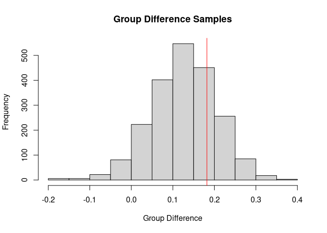<!-- -->

Here I show the posterior probability, with the true value (0.182, corresponding to 20%) marked in red.  We could also transform this to percentages if we wish


```r
hist(100*(exp(groupdif_samples)-1), xlab="Group Difference (%)", 
     main="Group Difference Samples as a Percentage")
abline(v=100*(exp(0.182)-1),col="red")
```

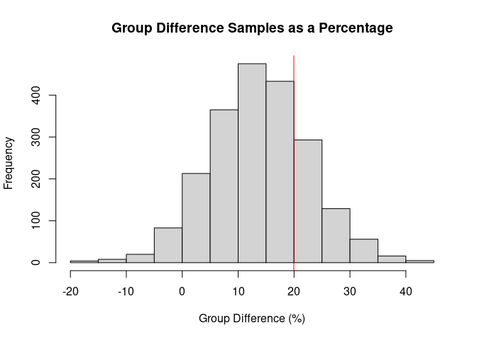<!-- -->


Now we can see the posterior probability.  We can also examine the quantiles to help us interpret the probability.


```r
quantile(groupdif_samples, seq(0.05, 0.95, by=0.05))
```

```
##           5%          10%          15%          20%          25%          30%          35%          40%          45%          50%          55%          60%          65%          70%          75% 
## -0.002600175  0.028417300  0.046112915  0.061068620  0.073004450  0.086465510  0.099566015  0.110811400  0.120921650  0.129090500  0.138676800  0.148146800  0.157437150  0.169133600  0.179465500 
##          80%          85%          90%          95% 
##  0.190777600  0.205201000  0.222358000  0.250030050
```

We could also examine what the probability that the parameter is above zero.


```r
mean(groupdif_samples > 0)
```

```
## [1] 0.9452381
```


With `brms`, we can also easily plot the estimated `sigma` spline.


```r
conditional_smooths(brmsfit)
```

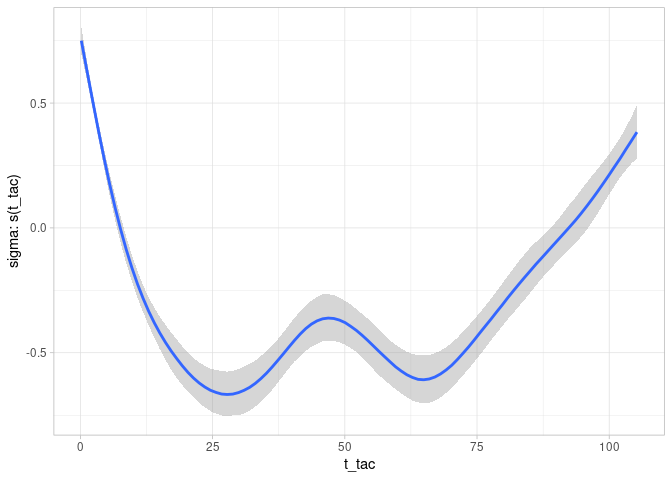<!-- -->


We could also, for example, examine the different estimated V~ND~ and v~B~ values of the different regions.


```r
re <- ranef(brmsfit)

re$Region[,,"logVnd_Intercept"] %>% 
  as_tibble(rownames = "Region") %>%
  mutate(Vnd_perc = 100*(exp(Estimate)-1),
         Vnd_perc_ci_lo = 100*(exp(`Q2.5`)-1),
         Vnd_perc_ci_hi = 100*(exp(`Q97.5`)-1)) %>% 
  mutate(Region = fct_reorder(Region, Estimate)) %>% 
  ggplot(aes(x=Region, y=Vnd_perc)) +
  geom_point() + 
  geom_errorbar(aes(ymin=Vnd_perc_ci_lo, ymax=Vnd_perc_ci_hi), width=0.2) +
  labs(y="Regional Vnd values relative to the mean (%)",
       title="Regional Vnd values")
```

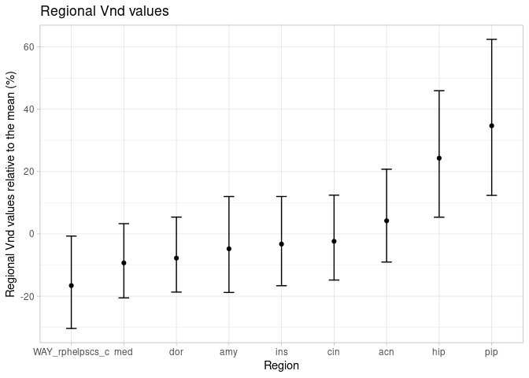<!-- -->

```r
re$Region[,,"logvB_Intercept"] %>% 
  as_tibble(rownames = "Region") %>%
  mutate(vB_perc = 100*(exp(Estimate)-1),
         vB_perc_ci_lo = 100*(exp(`Q2.5`)-1),
         vB_perc_ci_hi = 100*(exp(`Q97.5`)-1)) %>% 
  mutate(Region = fct_reorder(Region, Estimate)) %>% 
  ggplot(aes(x=Region, y=vB_perc)) +
  geom_point() + 
  geom_errorbar(aes(ymin=vB_perc_ci_lo, ymax=vB_perc_ci_hi), width=0.2) +
  labs(y="Regional vB values relative to the mean (%)",
       title="Regional vB values")
```

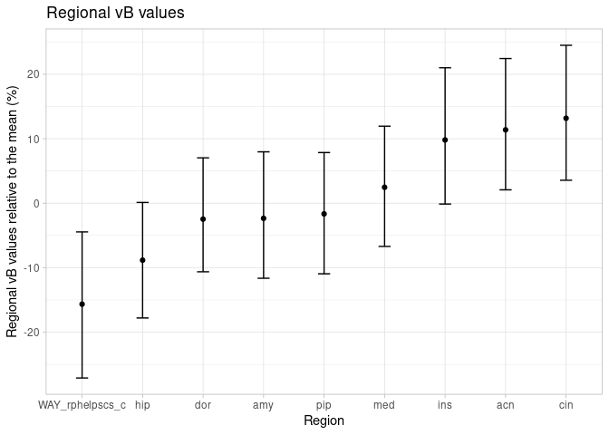<!-- -->

